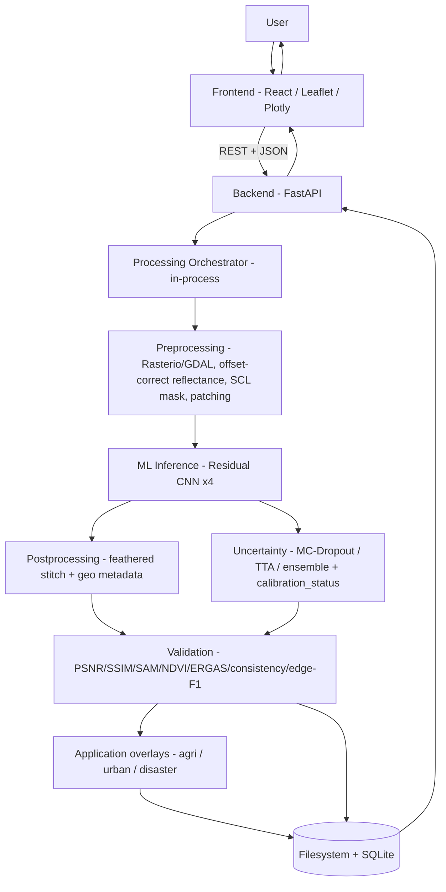

# Bhu-Dristi (SIH26142-TEAM ORCAS)

**Deep Learning Based Super Resolution Mapping (SRM) from Medium Resolution Satellite Imageries**
Smart India Hackathon 2026 · Problem Statement **26142** · **NTRO** · Category: Software · Theme: Space Technology

Bhu-Dristi turns freely available **10 m Sentinel-2** imagery into a finer **×4 → 2.5 m** output
grid, while **preserving spectral and geospatial consistency** and **explicitly reporting per-pixel
uncertainty** — because reconstructed detail is *inferred by the model, not observed by the sensor*.
The goal is not a prettier picture; it is a scientifically honest, GIS-ready, validated remote-
sensing product.

> **Design authority:** the project's single source of truth is the master specification. Backend
> design lives in [`docs/BACKEND_ARCHITECTURE.md`](./docs/BACKEND_ARCHITECTURE.md) and its
> production path in [`docs/BACKEND_PRODUCTION_READINESS.md`](./docs/BACKEND_PRODUCTION_READINESS.md).

---

## Problem statement

| Field | Value |
|---|---|
| **ID** | 26142 |
| **Title** | Deep Learning Based Super Resolution Mapping (SRM) from Medium Resolution Satellite Imageries |
| **Organization / Department** | National Technical Research Organisation (NTRO) |
| **Category** | Software |
| **Theme** | Space Technology |
| **Input dataset** | Sentinel-2 (10 m) via Copernicus Data Space — <https://browser.dataspace.copernicus.eu> |
| **Reference** | <https://www.youtube.com/watch?v=cQoHSStTEdM> |

Medium-resolution satellite imagery (**10–30 m**) is free, global and frequently revisited, and is
widely used for **change detection, agriculture, land-cover mapping, disaster monitoring and urban
planning**. But its spatial detail is often insufficient for fine-scale analysis — small buildings,
narrow roads, field boundaries, water edges, localized damage — which lowers the accuracy and
confidence of interpretation and decision-making. Bhu-Dristi uses deep-learning generative
super-resolution to extract greater value from this existing Earth-observation data: it takes
**10 m Sentinel-2** input and reconstructs sharper, information-rich outputs at **< 4 m**, while
**preserving the original geographic and spectral consistency** — not merely making the image look
clearer, but recovering useful fine-scale structure with an explicit account of uncertainty and error.

## What it does

- **Staged super-resolution:** bicubic baseline → **residual CNN (EDSR-lite, primary)** → optional
  Transformer (SwinIR-style) and GAN/diffusion as *labeled experiments only*. (The PS leaves the
  model family to the team — Transformers / Generative / CNN; we choose a **fidelity-first CNN** as
  primary to minimize hallucination, with GAN/diffusion available but flagged higher-risk.)
- **Spectral fidelity:** offset-correct Sentinel-2 reflectance; SAM + NDVI-consistency validation.
- **Geospatial correctness:** output keeps the input CRS and a correctly **scaled affine transform**
  (each 10 m pixel → exactly 4×4 output pixels); opens cleanly in any GIS.
- **Explicit uncertainty:** per-pixel uncertainty map (MC-Dropout / TTA / small-ensemble, chosen by
  a calibration study) with an honest `calibration_status`.
- **Rigorous validation** at three levels — **Real pairs** (headline) / **Synthetic** /
  **Self-consistency** — reported with PSNR, SSIM, SAM, NDVI-RMSE, ERGAS, edge-F1 and a
  no-reference `D(SR) ≈ LR` consistency check.
- **Three thin application overlays** on the SR output: **agriculture** (NDVI, field boundaries),
  **urban** (building/road visibility), **disaster** (before/after change with the uncertainty mask).

Input bands (V1, all native 10 m): **B2, B3, B4, B8**.

---

## Tech stack

| Layer | Technologies |
|---|---|
| **Frontend** | React · TypeScript · **Vite** · Tailwind CSS · **Leaflet** (map viewer) · **Plotly** (metric charts) |
| **Backend API** | **FastAPI** · Pydantic · Uvicorn · SQLite · in-process orchestrator (`BackgroundTasks`) |
| **Machine Learning** | **PyTorch** · TorchVision · scikit-image · Matplotlib · `timm` (Stage-3 Transformer only) |
| **Geospatial** | **Rasterio** · GDAL · **pyproj** · GeoPandas / Shapely (only if an app module needs vectors) |
| **Storage** | Local filesystem (rasters / previews / exports) + **SQLite** (job metadata) |
| **Runtime** | Python **3.11+** · Node **20 LTS** (pnpm) · CUDA / Apple **MPS** / CPU auto-detect |
| **DevOps** | Git · GitHub · **Docker** (GDAL parity) · GitHub Actions (minimal CI) |

**Deliberately not in V1:** Next.js, MapLibre, PostgreSQL/PostGIS, Redis/Celery, Kafka,
Kubernetes, object storage, xarray. These are revisited only for the production path
(see `docs/BACKEND_PRODUCTION_READINESS.md`), never for the hackathon prototype.

---

## Architecture (runtime path)



Steps up to model selection are **offline** (ML, before the demo); the diagram above is the **live
runtime path**. A job flows `created → queued → preprocessing → inference → postprocessing →
validation → done` (or `failed` with an `error_code`).

---

## Repository structure

```
Bhu-Dristi/
├── frontend/            # React + Vite (pages/, components/, api/, map/)
├── backend/app/         # api/, services/, repository/, main.py  (FastAPI)
├── ml/                  # models/, training/, inference/, uncertainty/  (PyTorch)
├── geospatial/          # io.py, patching.py, metadata.py  (shared by ml + backend)
├── validation/          # PSNR/SSIM/SAM/ERGAS/NDVI/consistency/edge-F1  (shared)
├── configs/             # training / preprocessing / experiment YAML
├── data/                # NOT committed: raw/, processed/  ·  splits/ IS committed
├── models/              # NOT committed: <name>/<version>/  ·  committed manifest.json
├── scripts/             # dataset download / preparation
├── tests/               # mirrors ml/, backend/, geospatial/
├── docs/                # master spec + backend architecture + production readiness
└── README.md
```

---

## Getting started

Prerequisites: **Python 3.11+**, **Node 20 LTS** (pnpm), Git; **Docker** recommended for GDAL/
Rasterio parity. Install PyTorch from the official selector for your platform (CUDA / MPS / CPU).

**Backend (FastAPI):**
```bash
cd backend
python -m venv .venv
source .venv/bin/activate          # Windows: .venv\Scripts\Activate.ps1
pip install -r requirements.txt
uvicorn app.main:app --reload --port 8000     # API + docs at http://localhost:8000/docs
```

**Frontend (React + Vite):**
```bash
cd frontend
pnpm install
pnpm dev                            # → http://localhost:5173
```

**Geospatial parity (recommended):** run the backend/ML inside Docker so GDAL is identical across
macOS and Windows.

---

## Scientific framing (what we do and don't claim)

- **We claim:** a higher-resolution *prediction* of the scene, trained to be spectrally and
  structurally consistent with the observed low-resolution input, with a per-pixel uncertainty proxy.
- **We do not claim:** recovery of true, previously unobserved detail. The **2.5 m grid is a nominal
  output sampling, not a claim of 2.5 m resolving power** — effective resolution is only what the
  reference-backed evidence (edge-F1, real-pair metrics) supports.
- The uncertainty map is always shown with the honest caption: *"Confidence reflects model prediction
  stability, not certainty of ground truth."*

## Data

- **Input:** Sentinel-2 **L2A** via the **Copernicus Data Space Ecosystem (CDSE)**.
- **HR reference (training/benchmark):** **SEN2NAIP** primary (real S2↔NAIP pairs at 2.5 m ≙ ×4);
  India-specific HR (Bhuvan / Cartosat) used for validation/fine-tuning if obtainable.
- Splits are **by geographic tile** (never by patch) to prevent leakage; test regions stay disjoint.

## Scope

**In scope (V1/MVP):** single-image SR on Sentinel-2 patches/ROIs; three lightweight application
overlays; end-to-end job pipeline with metrics + uncertainty + export bundle.
**Out of scope (V1):** authentication/multi-tenant, streaming ingestion, global mosaicking,
automated building/road detection, multi-temporal fusion SR (see the spec's advanced-features list).
---

*Bhu-Dristi is built for NTRO's Problem Statement 26142. It processes only synthetic/open sample
data during development; no classified imagery or credentials are included in this repository.*
