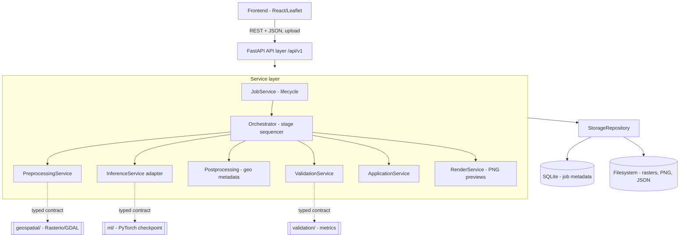
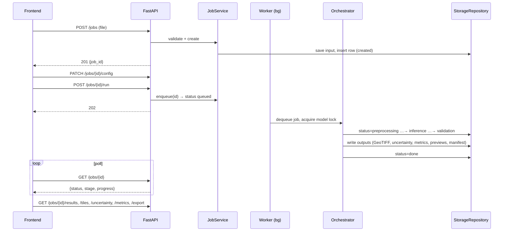

# Bhu-Dristi — Backend Architecture & Design

**SIH 2026 · PS 26142 (NTRO) — Deep-Learning Super-Resolution Mapping**
Scope of this doc: the **backend you own end-to-end**. It consolidates and makes concrete
Sections 5, 17, 18, 19, 20 of the master spec so you can build without re-reading the whole thing.

---

## 0. The idea in 30 seconds

The backend is the **conductor, not the orchestra**. It does **no** ML and **no** geospatial
maths itself. Its entire job is to be boring, reliable plumbing:

> Take an uploaded Sentinel-2 image, turn it into a **Job**, walk that job through a fixed
> pipeline (preprocess → super-resolve → restore geo-metadata → validate → application
> overlays), persist every artifact, and serve results, map previews and the export bundle
> back to the React frontend — while failing loudly and never corrupting data silently.

All the "intelligence" (the CNN, the reflectance maths, the metrics) lives **behind clean
seams** that other people implement. The backend only calls those seams through typed
contracts. This is what lets the backend, frontend and ML tracks move in parallel.

**Stack (locked):** FastAPI + Pydantic + Uvicorn · SQLite · local filesystem · in-process
background worker. **No** Redis/Celery, **no** Postgres/PostGIS, **no** cloud queue.

---

## 1. Responsibilities — what the backend IS and IS NOT

| The backend OWNS | The backend does NOT do (calls a seam instead) |
|---|---|
| Job lifecycle & state machine | ML inference maths → `InferenceService` (ML team) |
| Upload handling, validation, security | GeoTIFF I/O, reflectance, patching → `geospatial/` module |
| Orchestrating the pipeline stages | Metric formulas (PSNR/SSIM/SAM…) → `validation/` module |
| SQLite schema + all DB access | Model training (offline, never at runtime) |
| Filesystem storage layout (per-job dirs) | Auth / multi-tenant / rate-limiting (out of scope for V1) |
| PNG preview + uncertainty overlay rendering | Heavy raster decoding (that stays server-side, previews go to the browser) |
| Result / metrics / export endpoints | — |
| Concurrency (single-model lock), durability (restart recovery) | — |

**Mental model:** thin API → fat services → one storage repository → typed contracts to
`ml/`, `geospatial/`, `validation/` (which live *outside* `backend/` and are shared).

---

## 2. Guiding principles

1. **Everything is a Job.** One row in SQLite is the single source of truth for a run.
2. **Thin routes, fat services.** Routers only parse/validate and delegate. Logic lives in services.
3. **Contracts at every seam.** The backend depends on interfaces, not implementations, so a
   **mock** can stand in until the real ML/geospatial code lands (see §8).
4. **Fail loud, never silent.** Every failure sets `status=failed` + a machine-readable
   `error_code`. No half-written outputs are ever exposed.
5. **One model, serialized inference.** A single global lock guarantees only one job runs the
   model at a time; others wait in `queued`. This keeps memory bounded and the demo safe.
6. **Durable enough.** `BackgroundTasks` are not persistent — on startup, any job left mid-flight
   is marked `failed / interrupted`. The demo always has a cached fallback result.
7. **Filesystem for blobs, SQLite for metadata.** Big rasters/PNGs on disk under a UUID dir;
   small structured facts in the DB (metrics mirrored in for listing).
8. **Cross-platform.** Device auto-detect `cuda → mps → cpu`; CPU inference must work for the demo.

---

## 3. High-level architecture



Four layers, top to bottom: **API → Services → Repository → shared contracts**. Nothing skips
a layer; only the Repository touches SQLite or the disk.

---

## 4. Layered design

- **API layer** (`app/api/v1/`): FastAPI routers. Parse request, validate with Pydantic,
  call a service, shape the response, map exceptions → HTTP codes. No business logic.
- **Service layer** (`app/services/`): the real work.
  - `JobService` — create/list/get/patch-config/run; owns state transitions.
  - `Orchestrator` — runs the stage pipeline for one job (see §7).
  - `PreprocessingService` — wraps the `geospatial/` module (validate, reflectance, mask, patch).
  - `InferenceService` — the adapter to `ml/` (loads checkpoint once, runs `predict`, see §8).
  - `ValidationService` — wraps the `validation/` module; writes `metrics.json`.
  - `ApplicationService` — NDVI / visibility / change-diff overlays on the SR output.
  - `RenderService` — RGB & uncertainty PNG previews + WGS84 bounds for Leaflet.
- **Repository layer** (`app/repository/`): `StorageRepository` is the **only** thing that talks
  to SQLite and the filesystem. Every path is derived from the job UUID — user filenames are
  never used as paths.
- **Contracts / schemas** (`app/schemas/`, `app/core/`): Pydantic models, the status enum,
  error codes, settings, the `InferenceService` protocol, device detection, the global lock.

---

## 5. The Job: state machine

```
created ──patch config──▶ created ──run──▶ queued ──▶ preprocessing ──▶ inference
   │                                                                        │
   └──(upload only)                                                         ▼
                                          done ◀── validation ◀── postprocessing
                                            ▲            │
                                         applications ───┘
   any stage error ──▶ failed (with error_code)
   process restart while non-terminal ──▶ failed / interrupted
```

**Status enum:** `created | queued | preprocessing | inference | postprocessing | validation | done | failed`.

- `created` exists specifically so the **upload → configure → run** flow has a valid state to
  `PATCH /config` in. (The old enum started at `queued`, leaving config nowhere to act.)
- Asking for results before `done` returns **409 `not_ready`** (not 425).
- Each job row also carries `stage` + `progress` (0–100) for the frontend's polling stepper.

---

## 6. Per-job sequence



**Submission is synchronous; processing is asynchronous; the UI polls.**

---

## 7. The Orchestrator + worker (concurrency & durability)

The heart of the backend. Recommended concrete pattern (cleaner than raw `BackgroundTasks`):

- **One persistent background worker** (a single thread/consumer) drains an in-process queue.
  `POST /run` just enqueues the job id and returns `202`. Because there is exactly one consumer,
  inference is naturally serialized — a second job simply waits its turn in `queued`.
  (If you prefer `BackgroundTasks`, wrap the inference stage in a global `asyncio.Semaphore(1)` /
  `threading.Lock`; the single-worker queue gives you the same guarantee more simply.)
- **CPU-bound stages run in a threadpool** (plain `def` functions), never inside `async def`
  handlers, so the API stays responsive during a long inference.
- **Each stage is uniform:** `update status → run stage fn → on exception: status=failed +
  error_code + server-side traceback + safe user message`. Never leave a partial artifact visible.
- **Timeout** per job is configurable → `error_code=timeout`.
- **Startup recovery** (in the FastAPI lifespan hook): any job not in `{done, failed}` is set to
  `failed / interrupted`. This makes restarts safe and the demo deterministic.

Stage order the orchestrator runs: `preprocessing → inference (+uncertainty) → postprocessing
(geo metadata) → validation → applications → render previews → persist → done`.

---

## 8. The critical seam — `InferenceService` contract

This is the **one interface** that decouples you from the ML team. Agree it by Day 4; both
sides code against it independently.

```python
# app/services/inference.py  (backend owns the ADAPTER; ml/ owns the implementation)
def predict(
    lr: np.ndarray,            # float32 [4, H, W], reflectance in [0, 1]  (B2,B3,B4,B8)
    valid_mask: np.ndarray,    # bool    [H, W]
    config: InferenceConfig,   # model, scale=4, tile, overlap, n_samples, uncertainty_method
) -> SRResult:                 # .sr          float32 [4, sH, sW]
    ...                        # .uncertainty float32 [sH, sW] in [0, 1]
                               # .meta        {model_version, calibration_status, thresholds}
```

Backend responsibilities around this seam:
- **Load the checkpoint once** and cache it (at startup or first use); do **not** reload per patch.
- **Device auto-detect:** `cuda → mps → cpu`, with a warning on CPU fallback.
- **Ship a `MockInferenceService`** from Day 1: returns *bicubic upsample* as `sr` and a flat/
  random `uncertainty`, with `calibration_status=not_evaluated`. This lets the whole backend +
  frontend run a full job end-to-end **before the real model exists**. Swap the real one in behind
  the same interface with zero API changes.

The matching seams for `geospatial/` (`load_geotiff`, `to_reflectance`, `scl_mask`,
`extract_patches`, `restore_metadata`) and `validation/` (`compute_metrics(sr, hr?, lr)`) follow
the same rule: backend defines the call signature, the other track implements it, a mock unblocks you.

---

## 9. API surface (`/api/v1`)

| Method | Path | Purpose | Codes |
|---|---|---|---|
| POST | `/jobs` | Upload + create job → `created` | 201, 400, 413 |
| GET | `/jobs` | List (paged) | 200 |
| GET | `/jobs/{id}` | Status, stage, progress | 200, 404 |
| PATCH | `/jobs/{id}/config` | Set model / bands (read-only) / ROI while `created` | 200, 404, 409 |
| POST | `/jobs/{id}/run` | Enqueue → `queued` | 202, 404, 409 |
| GET | `/jobs/{id}/results` | Result summary + metadata contract | 200, 404, 409 |
| GET | `/jobs/{id}/tiles/{layer}` | PNG preview (`original`, `enhanced`) | 200, 404 |
| GET | `/jobs/{id}/uncertainty` | Uncertainty overlay PNG | 200, 404 |
| GET | `/jobs/{id}/metrics` | Full metrics JSON | 200, 404 |
| GET | `/jobs/{id}/applications/{type}` | `agriculture` \| `urban` \| `disaster` | 200, 400, 404 |
| GET | `/jobs/{id}/export` | Zip: enhanced GeoTIFF + uncertainty GeoTIFF + metrics JSON + manifest | 200, 404, 409 |

**`/results` metadata contract** (the shape the frontend binds to):

```jsonc
{
  "bounds": [[lat,lng],[lat,lng]],   // WGS84, reprojected by the backend for Leaflet
  "crs": "EPSG:32643",
  "scale_factor": 4,
  "output_resolution_m": 2.5,
  "thumbnails": { "original": "...", "enhanced": "...", "uncertainty": "..." },
  "metrics_summary": { "psnr": null, "ssim": null, "sam": null },
  "confidence_summary": { "low": 0.2, "medium": 0.5, "high": 0.3 },
  "calibration_status": "not_evaluated",          // not_evaluated | failed_check | provisional | calibrated
  "degradation_tier": 0,
  "validation_level": ["synthetic"]                // real_pairs | synthetic | self_consistency
}
```

---

## 10. Data model (SQLite)

Keep it to **one table** for V1 (add `job_events` only if you want an audit trail).

```sql
CREATE TABLE jobs (
  id                TEXT PRIMARY KEY,          -- UUID4
  status            TEXT NOT NULL,             -- status enum
  stage             TEXT,                      -- current stage label
  progress          INTEGER DEFAULT 0,         -- 0..100
  created_at        TEXT NOT NULL,
  updated_at        TEXT NOT NULL,
  -- input facts (filled at upload/validate)
  input_path        TEXT,
  input_crs         TEXT,
  input_bands       TEXT,                      -- JSON ["B2","B3","B4","B8"]
  input_res_m       REAL,
  input_size        TEXT,                      -- JSON [w,h]
  -- config (filled by PATCH /config)
  config            TEXT,                      -- JSON {model, roi, scale, tile, overlap, uncertainty_method}
  -- results (filled by orchestrator)
  scale_factor      INTEGER,
  output_res_m      REAL,
  metrics_summary   TEXT,                      -- JSON, mirrored from metrics.json for fast listing
  calibration_status TEXT DEFAULT 'not_evaluated',
  degradation_tier  INTEGER,
  validation_level  TEXT,                      -- JSON array of labels
  -- failure
  error_code        TEXT,
  error_message     TEXT
);
CREATE INDEX idx_jobs_status ON jobs(status);
CREATE INDEX idx_jobs_created ON jobs(created_at);
```

Access it only through `StorageRepository`. SQLite in WAL mode; the single worker means no write
contention to design around.

---

## 11. Storage layout (filesystem)

```
data/
├── jobs/
│   └── <uuid>/
│       ├── input/original.tif
│       ├── work/                 # patches / intermediates (safe to delete after done)
│       ├── output/
│       │   ├── enhanced.tif      # 4-band SR GeoTIFF, correct CRS + scaled affine
│       │   └── uncertainty.tif   # pixel-aligned uncertainty, [0,1]
│       ├── preview/
│       │   ├── original.png  enhanced.png  uncertainty.png  + thumbs
│       ├── applications/agriculture.json  urban.json  disaster.json
│       ├── metrics.json
│       └── manifest.json         # source date, product id, baseline, CRS, bands,
│                                 # in/out res, model version, degradation tier,
│                                 # scale factor, calibration status, validation summary
├── samples/                      # bundled demo scenes (rehearsal + fallback)
└── splits/                       # committed to git (ML), read-only to backend
models/
└── <name>/<version>/checkpoint.pt + manifest.json   # not in git; committed manifest
```

Uploads live **outside** any static directory and are served only through explicit API endpoints.

---

## 12. Rendering / previews (RenderService)

The browser never decodes GeoTIFFs. The backend pre-renders:
- **RGB preview**: read B4/B3/B2 via Rasterio → per-band percentile stretch (e.g. 2–98%) → 8-bit PNG.
- **NIR false-colour** (optional): B8/B4/B3.
- **Uncertainty overlay**: colormap the `[0,1]` map → semi-transparent PNG.
- **Bounds**: reproject the raster corners to **WGS84** so Leaflet can place `ImageOverlay`s.

Previews are display-only and cached on disk; **exports are always the real GeoTIFFs**.

---

## 13. Error handling, validation & security

- **Uniform error body:** `{ "error_code": "...", "message": "..." }`.
- Pydantic body errors → **422**; domain errors → **400** with a specific code; not-ready → **409**.
- **Codes:** `corrupt_file`, `unsupported_crs`, `missing_bands`, `oversized`, `out_of_memory`,
  `timeout`, `interrupted`, `not_ready`, `storage_error`.
- **Upload safety (do before decoding):** verify it is a real GeoTIFF (magic/structure, not just
  the extension); enforce size **and** raster-dimension caps; reject geographic (degree) CRS with
  `unsupported_crs` + the accepted list; treat every upload as untrusted; write to a UUID dir,
  never using the user's filename as a path.
- **Not built for V1:** auth, rate-limiting, encryption-at-rest. Endpoints are *explicit*, not
  *authenticated*.

---

## 14. Backend folder structure

```
backend/app/
├── main.py                 # FastAPI app, CORS, lifespan (startup recovery, load model, start worker)
├── core/
│   ├── config.py           # Settings (paths, caps, timeout, device pref) via pydantic-settings
│   ├── errors.py           # error codes + exception→HTTP mapping
│   ├── device.py           # cuda→mps→cpu detection
│   └── worker.py           # in-process queue + single consumer loop + model lock
├── api/v1/
│   ├── jobs.py             # POST/GET/PATCH/run
│   ├── results.py          # results, tiles, uncertainty, metrics, applications
│   └── exports.py          # export zip
├── schemas/
│   ├── job.py  config.py  results.py  errors.py   # Pydantic models + status enum
├── services/
│   ├── job_service.py  orchestrator.py
│   ├── preprocessing.py  inference.py  validation.py  applications.py  rendering.py
│   └── mocks.py            # MockInferenceService etc. for parallel dev
├── repository/
│   ├── db.py               # SQLite connection/migrations
│   ├── storage.py          # StorageRepository (paths + DB CRUD)
│   └── models.py           # row <-> dataclass/pydantic mapping
tests/backend/              # schema, upload-validation, state-transition, startup-recovery tests
Dockerfile                  # GDAL/Rasterio parity + reproducible demo
```

`ml/`, `geospatial/`, `validation/` are **siblings of `backend/`**, imported as shared packages —
they are not inside the backend and you do not implement them, you consume them.

---

## 15. Build order (what to code first)

Because you own the whole backend, sequence it as two waves (mirrors the spec's Backend-1 /
Backend-2 split so you can pause cleanly):

**Wave A — make a job flow (unblocks the frontend fastest):**
1. FastAPI skeleton, `core.config`, health check, CORS.
2. SQLite schema + `StorageRepository` (with the `created` state).
3. `POST/GET/PATCH/run` job endpoints.
4. Orchestrator + single-worker queue running a **fully mocked** pipeline (sleeps + writes dummy
   PNG/JSON). Startup recovery. → *The frontend can now integrate against a real API.*

**Wave B — make the job real:**
5. Wire `PreprocessingService` to the real `geospatial/` module.
6. Wire `InferenceService` to `MockInferenceService`, then the real checkpoint behind the same interface.
7. `ValidationService` + `metrics.json`; `RenderService` PNG previews + WGS84 bounds.
8. `ApplicationService` (one tab working: NDVI is easiest); export zip + `manifest.json`.
9. Concurrency hardening (lock proven with a 2-job test), full error-case coverage, Dockerfile.

**Definition of done (backend slice):** a job runs **end-to-end via the API alone** (no UI) on a
sample scene — correct geo-metadata in the output GeoTIFF, `metrics.json`, an uncertainty map with
a `calibration_status`, one application overlay, and an export bundle that opens in QGIS; 2+
concurrent jobs serialize safely; a mid-run restart recovers to `interrupted`.

---

## 16. Non-negotiables to keep in mind

- Output GeoTIFF must keep the input **CRS** and use `output_transform = input_transform *
  scale(1/4)` about the **same top-left corner** (each 10 m pixel → exactly 4×4 output pixels).
  Never re-centre. (The maths is in `geospatial/`, but the backend must not mangle the metadata it
  passes through.)
- Every result carries its **uncertainty map** and its **`calibration_status`** — the frontend
  always shows the honest caption; the backend must always populate the field.
- Never expose a partially-written or failed job's artifacts.
