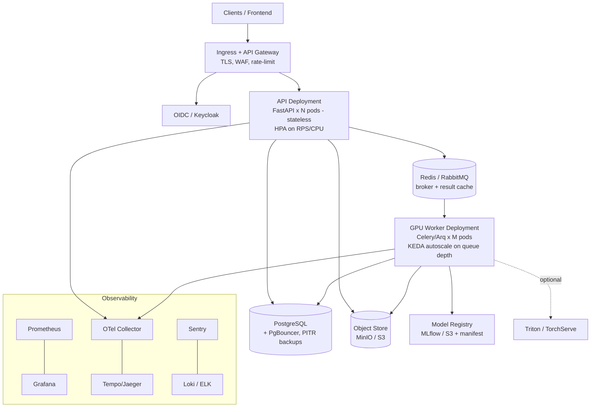

# Bhu-Dristi — Production / Deploy-Ready Backend Architecture

**Deep Learning Based Super Resolution Mapping (SRM) from Medium Resolution Satellite Imageries**
Smart India Hackathon 2026 · Problem Statement **26142** · **NTRO** · Category: Software · Theme: Space Technology

**Companion to [`BACKEND_ARCHITECTURE.md`](./BACKEND_ARCHITECTURE.md).** That doc is the clean
prototype (SQLite · local filesystem · in-process worker). This doc is how the **same domain
design** becomes an industry-grade, deployable service.

> **The key insight:** the prototype was built around *seams* (`InferenceService`, `geospatial/`,
> `StorageRepository`, a stage orchestrator). Going to production is therefore **replacing infra
> adapters behind those seams + adding operational pillars** — not a rewrite. The FastAPI routes,
> Pydantic contracts, job state machine and service boundaries stay the same.

### Assumption that shapes everything (tell me if wrong)
Primary target = **self-hosted / on-prem Kubernetes, air-gap-friendly** (fits NTRO + classified
data). Every component below is chosen to run **without external SaaS**; the managed-cloud
equivalent is named inline (e.g., MinIO → S3, Keycloak → Cognito/Auth0). If you're actually
deploying to a public cloud or a single VM, several choices simplify — say so and I'll re-cut it.

### Why production-readiness matters for THIS problem statement
PS 26142 asks for a system whose enhanced outputs are *"scientifically reliable and useful for
real-world remote-sensing applications"* at NTRO. That is not only an ML claim — it is an
**operational** one. Production readiness is how the PS's requirements survive contact with real
use; each pillar below exists to protect a specific PS requirement:

| PS 26142 requirement | Production concern that protects it |
|---|---|
| Outputs must be *scientifically reliable* and *validated against high-resolution references* | Reproducible **model registry** + versioned runs; every job records `model_version`, degradation tier, validation level and `calibration_status`; **canary model rollout gated on metrics** (§3.4) |
| *Clearly account for uncertainty and error* (inferred vs observed) | Uncertainty map + `calibration_status` **persisted with every result and never dropped**; honest caption enforced end-to-end (carried from the base architecture) |
| Preserve *geospatial and spectral consistency* | Geo-metadata carried through storage/export **unchanged**; GeoTIFF hardening; QGIS-openable exports; footprint stored in PostGIS (§3.3, §3.5) |
| Support *crop monitoring / urban analysis / disaster assessment* for NTRO analysts | **Reliability** (SLOs, retries/DLQ, DR) so analysts can depend on it; **audit trail** of who ran/downloaded what (§3.5–3.7) |
| Handle *10 m Sentinel-2 → <4 m (×4)* at real workload | **GPU worker fleet + queue autoscaling**; tiled, memory-bounded inference; capacity planning (§3.2, §3.7) |
| **NTRO / Space-Technology / classified** context | **On-prem, air-gap-friendly**; encryption at rest + in transit; RBAC + tenant isolation; network isolation; data classification (§3.5) |

In short: the science is decided in the base architecture and the ML spec; **this document keeps
that science trustworthy, secure and available once real NTRO users depend on it.**

---

## 0. What "deploy-ready" means here — the pillars

| Pillar | The question it answers |
|---|---|
| **Scalability** | Can it handle many concurrent jobs / users without falling over or over-provisioning GPUs? |
| **Reliability** | Do jobs survive crashes, restarts, and poison inputs? Is there DR/backup? |
| **Security** | Auth, tenant isolation, hardened uploads, secrets, audit — fit for classified data? |
| **Observability** | When it breaks at 2 a.m., can you see *what* and *why* in minutes? |
| **Deployability** | One-command, reproducible, rollback-able releases across environments? |
| **Maintainability** | Migrations, config, testing, and clear module boundaries as the team grows? |
| **Data governance** | Retention, deletion, provenance, classification — legally/operationally defensible? |

**Non-goal:** premature microservices. Keep a **modular monolith API + a worker fleet**. Do not
shard this into ten services; that adds ops burden with no benefit at this scale.

---

## 1. Prototype → Production: the swaps

| Concern | Prototype (hackathon) | Production (this doc) | Why it must change |
|---|---|---|---|
| Async work | in-process `BackgroundTasks` + global lock | **Distributed task queue** (Celery *or* Arq) + **Redis/RabbitMQ** broker; dedicated **GPU worker pool** | Stateless API can't hold jobs; jobs must survive API restarts; GPUs scale independently |
| Job durability | "mark interrupted on startup" | **Durable queue** with `acks_late` + retries + **dead-letter queue** | Real delivery guarantees, not a best-effort hack |
| Database | SQLite file | **PostgreSQL** + SQLAlchemy 2.0 + **Alembic** migrations + **PgBouncer** pool (PostGIS optional) | Concurrent multi-pod writes; schema evolution; footprint queries |
| Blob storage | local `data/<uuid>/` | **S3-compatible object store** (MinIO on-prem / S3·GCS cloud) + presigned URLs | Stateless API pods can't share a local disk |
| Model artifacts | file in `models/` | **Model registry** (MLflow or S3 + signed manifest); optional **Triton/TorchServe** | Versioning, canary rollout, warm GPU serving |
| Config | Python constants | **12-factor env** via `pydantic-settings` + **secrets manager** (Vault / Sealed Secrets) | No secrets in code/images; per-env values |
| AuthN/Z | none ("explicit endpoints") | **OIDC/OAuth2** (Keycloak) → JWT + **RBAC** + service **API keys** + tenant scoping | Real users, least privilege, audit |
| Serving | `uvicorn --reload` | **Gunicorn + Uvicorn workers** behind **Ingress + TLS**, containerized on **K8s** | Concurrency, TLS, rollout, health-managed |
| Status delivery | polling | polling **+ webhooks / SSE** callback on completion | Polling doesn't scale; integrations want push |
| Observability | print/logs | **Structured logs + Prometheus + OpenTelemetry + Sentry + Grafana** | You can't operate what you can't see |

Everything else from the base doc (job state machine, `/api/v1` surface, the `InferenceService`
contract, error codes, upload validation, RenderService) **carries over unchanged**.

---

## 2. Target deployment topology



- **API pods**: stateless, cheap, CPU-only, autoscale on request rate. They *never* run the model.
- **GPU worker pods**: pinned to a GPU node pool, autoscale on **queue depth** (KEDA), each pod
  processes one job at a time. Throughput = number of GPU workers — **no global lock needed
  anymore** (the prototype's single lock is replaced by "one job per worker + a shared queue").
- **Data plane**: Postgres (jobs/metadata), Redis (broker + cache), object store (rasters,
  previews, exports, checkpoints). All backed up.

---

## 3. Component deep-dives

### 3.1 API tier
- **Gunicorn** managing `uvicorn.workers.UvicornWorker` (workers ≈ 2×vCPU; tune). Stateless, so
  scale horizontally behind the ingress.
- **Probes**: `/healthz` (liveness), `/readyz` (readiness — checks DB + broker + object store
  reachability). K8s uses these for rollout/traffic gating.
- **Graceful shutdown**: handle SIGTERM, stop accepting, drain in-flight requests, close pools.
- **Request hardening**: max body size at the ingress *and* app; request timeout; CORS locked to
  known origins; security headers (HSTS, CSP for any served content, `X-Content-Type-Options`).

### 3.2 Async processing tier (the biggest change)
- **Broker + workers**: Celery (mature, battle-tested) or **Arq** (async-native, lighter) on
  **Redis**; RabbitMQ if you need stronger routing/priorities. Job = enqueue `job_id`; the worker
  reloads state from Postgres/object store (never trust large payloads in the queue).
- **GPU workers**: `--concurrency=1` per GPU (or batched); **model loaded once per process and
  kept warm**. Node pool with GPUs; taints/tolerations + `nvidia.com/gpu` resource requests.
- **Autoscaling**: **KEDA** scales workers on **queue length** (scale-to-N on backlog, scale-to-
  a-floor when idle to keep one warm). This is the single most important prod behaviour for a
  bursty ML workload.
- **Delivery semantics**: `acks_late=True` + `visibility timeout` so a crashed worker's job is
  redelivered. **Idempotent stages** (writes keyed by `job_id`/stage) so redelivery is safe.
- **Retries + DLQ**: transient errors retry with exponential backoff; after N attempts →
  **dead-letter queue** + job `failed` with the last `error_code`. Poison inputs never loop forever.
- **Timeouts + backpressure**: per-stage soft/hard timeouts; if the queue exceeds a cap, `POST
  /run` returns **429** with `retry-after` instead of unbounded growth.
- **Priorities (optional)**: interactive/demo jobs on a high-priority queue; batch on low.

### 3.3 Data tier
- **PostgreSQL** via SQLAlchemy 2.0 (async) + **Alembic** migrations (run as a K8s `Job` in the
  release, gated before rollout). **PgBouncer** for pooling across many pods.
- **PostGIS (optional but recommended for a geospatial product)**: store each job's **footprint
  polygon** (WGS84) so you can answer "jobs intersecting this AOI/date range" — a real feature,
  not decoration. Skip if you never query spatially.
- **Multi-tenancy**: every job row carries `org_id` + `owner_id`; **every query is tenant-scoped**
  (enforced in the repository, ideally also via Postgres **row-level security** as defence-in-depth).
- **Object storage layout** (mirrors the prototype's per-job dirs, now bucketed):
  `s3://bhu-dristi/jobs/<org>/<uuid>/{input,output,preview,applications,metrics.json,manifest.json}` and
  `s3://bhu-dristi/models/<name>/<version>/`. Downloads via **short-lived presigned URLs**, never by
  streaming through the API.
- **Lifecycle**: object-store lifecycle rules auto-expire `input/` and `work/` after N days; keep
  `output/` + `manifest.json` per retention policy. Postgres **PITR** backups; tested restores.
- **Caching**: Redis caches `/results` summaries and hot preview URLs; a **CDN** (or ingress cache)
  fronts immutable preview PNGs.

### 3.4 Model tier
- **Registry + versioning**: each checkpoint has an immutable version + signed `manifest.json`
  (metrics, degradation tier, calibration status, git SHA, training data split). The API records
  `model_version` on every job for reproducibility.
- **Rollout**: **canary a new model** to a small % of jobs, compare metrics, then promote —
  models are released like code.
- **Serving**: default = PyTorch loaded in the GPU worker (simplest). If you need higher
  throughput / multi-model / dynamic batching, put the model behind **Triton** or **TorchServe**
  and let workers call it — a clean later upgrade behind the same `InferenceService` seam.
- **Reproducibility**: pinned CUDA/torch, fixed seeds, versioned preprocessing config, GPU/driver
  recorded in the manifest.

### 3.5 Security (government-grade)
- **AuthN**: OIDC via **Keycloak** (self-hostable, air-gap-friendly); users get JWTs; services use
  scoped **API keys / client credentials**.
- **AuthZ**: **RBAC** (roles: viewer / analyst / admin) + tenant isolation on every resource.
- **Upload hardening (beyond the prototype)**: structure-validate the GeoTIFF; enforce size **and
  pixel-dimension** caps *before* decode; **allowlist GDAL drivers** and disable dangerous ones;
  guard against **decompression bombs** (max uncompressed size / band count); scan with size + time
  budgets; process in a **sandboxed worker** with no outbound network.
- **Network**: **NetworkPolicies** (default-deny; API↔broker↔workers↔DB only), **mTLS** between
  services (service mesh optional), TLS at ingress, private subnets for data stores.
- **Secrets**: **Vault** or **Sealed Secrets**; nothing in images/env files; rotation policy.
- **Supply chain**: pinned deps + **hash-locked** requirements; **Trivy/Grype** image scans,
  **Bandit** + **pip-audit** in CI, **SBOM** (Syft) per build, signed images (cosign).
- **Audit**: append-only audit log of who did what (create/run/download/delete) → SIEM.
- **Data classification (NTRO)**: tag jobs/artifacts with classification; enforce storage
  segregation and access by clearance; encryption at rest (object store SSE + Postgres TDE/volume
  encryption) and in transit; document a data-handling policy.

### 3.6 Observability
- **Structured JSON logs** with a **correlation/trace id** propagated request → job → stages
  (shipped to Loki/ELK).
- **Metrics (Prometheus)** — RED for the API (rate/errors/duration) and **USE + domain metrics**
  for workers: `queue_depth`, `jobs_in_flight`, `stage_duration_seconds{stage=}`,
  `inference_seconds`, `gpu_utilization`, `job_failures_total{error_code=}`. These drive the KEDA
  autoscaler *and* the dashboards.
- **Tracing (OpenTelemetry)** across API → broker → worker stages → Tempo/Jaeger.
- **Errors**: **Sentry** for exceptions with release + trace context.
- **Dashboards + alerting (Grafana/Alertmanager)**: SLO burn, queue backlog, failure-rate,
  GPU saturation, DB/broker health → on-call.

### 3.7 Reliability / SRE
- **SLOs** (define + measure): e.g., API availability 99.5%, job success rate ≥ 99% (excluding
  user-error inputs), P95 job latency within a target for a reference scene.
- **K8s guardrails**: resource **requests/limits** (esp. GPU + memory), **PodDisruptionBudgets**,
  liveness/readiness/startup probes, anti-affinity for API replicas, `terminationGracePeriod`
  long enough to drain a running inference.
- **DR/backup**: Postgres PITR, object-store versioning + cross-site replication (or offline
  backup for air-gap), documented **RPO/RTO**, periodic **restore drills**.
- **Chaos/load**: kill a worker mid-job → job redelivers and completes; **k6/Locust** load tests to
  find the GPU saturation point; capacity plan from measured numbers.
- **Runbooks**: "queue backed up", "GPU OOM", "model rollback", "restore DB" — written before launch.

### 3.8 CI/CD
- **Pipeline (GitHub Actions or GitLab CI)**: lint/type (ruff, mypy) → unit tests → **integration
  tests with Testcontainers** (real Postgres + Redis + MinIO) → security scans (Bandit, pip-audit,
  Trivy) → **multi-stage Docker** build (slim runtime, non-root user, GDAL layer pinned) → SBOM +
  image sign → push to **private registry** (Harbor on-prem) → deploy.
- **Delivery**: **GitOps (ArgoCD/Flux)** or Helm; **Alembic migration Job** runs and must succeed
  before the new version takes traffic; **canary or blue-green** rollout with automated rollback on
  health/SLO regression.
- **Environments**: `dev → staging → prod`, identical manifests via Helm values; promote by tag.
- **Air-gap**: mirror base images + wheels into the internal registry/PyPI proxy; builds pull only
  from internal sources.

### 3.9 API hardening
Versioned (`/api/v1`); cursor **pagination + filtering** on `GET /jobs`; consistent
`{error_code,message,trace_id}` envelope; **idempotency-key** header on `POST /jobs` so retries
don't duplicate; **rate limiting** per token/tenant; **webhooks** (signed) + optional **SSE** for
job completion; request-size caps; OpenAPI published; deprecation policy for versions.

---

## 4. Repo additions for production

```
backend/
├── app/                     # (unchanged domain code from the base architecture)
│   ├── core/                # + settings from env, secrets, otel, auth, ratelimit
│   ├── repository/          # storage.py now targets Postgres + object store behind the same API
│   └── workers/             # celery/arq app, tasks, retry/DLQ policy
├── migrations/              # Alembic
├── Dockerfile               # multi-stage, non-root, pinned GDAL
├── deploy/
│   ├── helm/                # chart: api, worker, migrations job, HPA, KEDA ScaledObject,
│   │                        #        NetworkPolicy, PDB, ServiceMonitor, Ingress
│   ├── values-dev.yaml  values-staging.yaml  values-prod.yaml
│   └── dashboards/          # Grafana JSON, alert rules
├── .github/workflows/       # ci.yml (test+scan+build+sign), cd.yml (deploy via GitOps)
└── tests/                   # unit + integration(testcontainers) + load(k6) + contract
```

Because storage and the worker sit **behind the existing `StorageRepository` and
`InferenceService` seams**, swapping SQLite→Postgres and in-process→Celery touches those adapters
and the deploy folder — **not** the routers or the domain logic.

---

## 5. Phased hardening roadmap (don't boil the ocean)

Reach a defensible bar first, then deepen. **Minimum Viable Production (P0)** is the honest line
for "deploy-ready"; P1/P2 are maturity.

| Phase | Deliverables |
|---|---|
| **P0 — Minimum Viable Production** | Postgres+Alembic · object store · Celery/Arq + Redis + GPU workers with retries/DLQ · OIDC auth + RBAC + tenant scoping · Dockerized, on K8s via Helm · TLS ingress · secrets manager · structured logs + Prometheus + health probes · CI with tests+scans · backups + one tested restore · hardened uploads |
| **P1 — Operable at scale** | KEDA queue-autoscaling · OTel tracing + Grafana dashboards + alerting + Sentry · webhooks/SSE · caching + CDN for previews · canary/blue-green + GitOps · load-tested capacity plan · runbooks · PgBouncer |
| **P2 — Enterprise depth** | PostGIS footprint search · model registry + canary model rollout · Triton serving · row-level security + mTLS/service mesh · SBOM + signed images + policy gates (OPA) · DR site / air-gap replication · SOC/audit integration · cost controls |

---

## 6. What to deliberately NOT do (yet)
- Don't split into microservices — a modular monolith API + worker fleet is correct here.
- Don't hand-roll a scheduler/queue — use a proven broker.
- Don't stream big rasters through the API — presigned URLs.
- Don't invent SLO/latency numbers — **measure** on a reference scene and a load test, then set targets.
- Don't add Kafka/Spark/feature-stores — no requirement in this system.

---

## 7. The one-line summary
Keep the clean prototype's **domain design**; replace **SQLite→Postgres, filesystem→object store,
in-process worker→broker+GPU worker fleet**; wrap it in **auth, observability, CI/CD, K8s, and
data governance**. Because everything already lives behind seams, this is an **infrastructure
upgrade, not a rewrite** — which is exactly why the base architecture was built that way.
