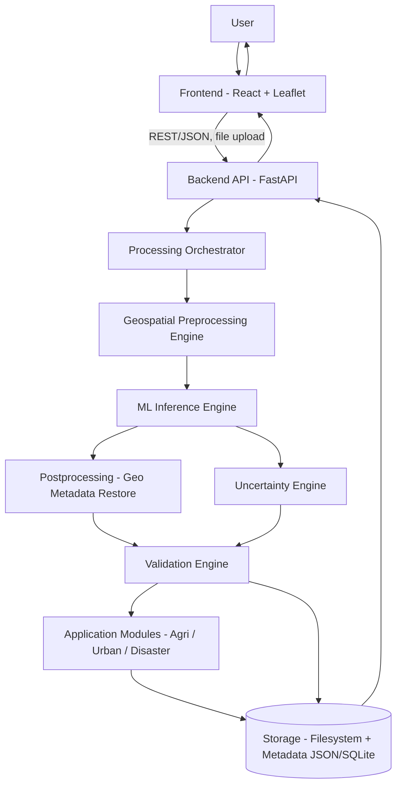
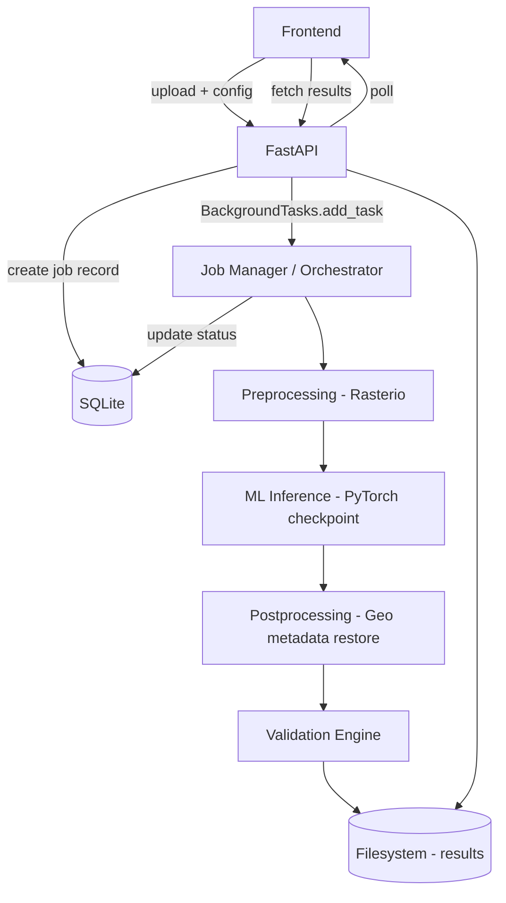
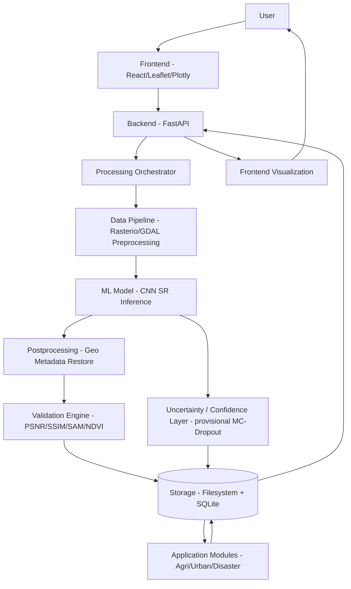

# GeoSR-AI
## SIH 2026 — PS 26142
### Deep Learning Based Super Resolution Mapping from Medium Resolution Satellite Imagery

| Field | Value |
|---|---|
| Document version | 1.2 |
| Status | Team-ready — Planning & Prototyping Phase |
| Last updated | 2026-09-02 |
| Project owners | ML Lead, Backend Lead, Frontend Lead (to be assigned by team) |
| Team structure | 2 Frontend · 2 Backend · 2 ML/Data Science (6 total) |
| Organization | National Technical Research Organisation (NTRO) |
| Category / Theme | Software / Space Technology |

> This document is the single source of truth for the team. It supersedes verbal decisions. Any change to scope, stack, or architecture should be reflected here first.

---

## Table of Contents

1. Project Overview
2. Problem Understanding
3. Requirements Analysis
4. Product Vision
5. System Architecture
6. End-to-End Workflow
7. Data Architecture
8. Sentinel-2 Data Design
9. Machine Learning Architecture
10. Model Input/Output Design
11. Loss Functions
12. Uncertainty Estimation
13. Validation and Evaluation
14. Geospatial Processing
15. Application Modules
16. Frontend Architecture
17. Backend Architecture
18. ML/Backend Integration
19. Storage Architecture
20. Project Directory Structure
21. Technology Stack
22. Development Environment
23. Hardware Requirements
24. Mac vs Windows Strategy
25. Team Responsibilities
26. Development Phases
27. MVP Definition
28. Advanced Features
29. Testing Strategy
30. Failure Cases
31. Security
32. Performance Strategy
33. Deployment Architecture
34. Git and Collaboration Strategy
35. Data and Model Versioning
36. Experiment Tracking
37. Research Questions
38. Open Decisions
39. Risks
40. Scientific Validity
41. SIH Demo Flow
42. Judge-Facing Differentiators
43. Development Checklist
44. Definition of Done
45. Final Master Architecture
46. Next 7 Days — Prototyping Plan

---

## SECTION 1 — Project Overview

**Project name:** **GeoSR-AI** — evaluated against alternatives (`Sentinel-SRNet`, `EarthEnhance`, `PixelUp-GeoAI`). `GeoSR-AI` is kept: it's short, communicates "Geospatial Super-Resolution AI" unambiguously to judges, and reads well on slides/domain names. No change recommended.

- **SIH problem statement:** 26142
- **Title:** Deep Learning Based Super Resolution Mapping (SRM) from Medium Resolution Satellite Imageries
- **Organization:** NTRO
- **Theme:** Space Technology

**Problem summary:** Sentinel-2 imagery (10–30 m) is freely available and frequently revisited but too coarse for fine-scale analysis (small buildings, narrow roads, field boundaries, localized damage). We build a deep-learning super-resolution (SR) system that enhances 10 m Sentinel-2 imagery to a target resolution below 4 m, while preserving geospatial and spectral consistency and explicitly quantifying uncertainty in inferred detail.

**Proposed solution:** A staged CNN→Transformer SR pipeline (GAN/diffusion as optional stretch), wrapped in a geospatially-aware preprocessing/postprocessing pipeline, served via a FastAPI backend, visualized in a React/Leaflet frontend, with quantitative validation (PSNR/SSIM/SAM/ERGAS/NDVI-consistency) and an uncertainty map shown alongside every output.

**Core objective:** Demonstrably increase usable spatial detail from Sentinel-2 imagery for agriculture, urban, and disaster-assessment use cases — with measurable, reproducible, and honestly-communicated results (not just a "sharper-looking" image).

**Key differentiators:**
- Explicit observed-vs-inferred distinction (uncertainty map) — most hackathon SR demos skip this entirely.
- Geospatial and spectral fidelity treated as first-class requirements, not afterthoughts.
- Staged model roadmap (baseline → CNN → transformer → optional GAN) instead of one high-risk model bet.
- Application-oriented outputs (agriculture/urban/disaster), not a generic "prettier image" demo.

**Target users:** Government remote-sensing analysts, agriculture departments, disaster-response agencies, urban planning bodies — i.e., NTRO and downstream users of medium-resolution EO data.

**Intended applications:** Crop monitoring, field-boundary delineation, land-cover mapping, urban building/road visibility, disaster/change-detection assessment.

**Project scope (in-scope for hackathon):**
- Single-image SR of Sentinel-2 patches (not full-scene mosaicking at production scale).
- One primary geography/region for training+validation (with note on generalization limits).
- Three lightweight application overlays (agriculture/urban/disaster), not full detection models.

**Out-of-scope features:**
- Real-time streaming/continuous ingestion pipelines.
- Multi-temporal time-series fusion SR.
- Automated building/road extraction (object detection) — only *visibility improvement*, not detection.
- Production-grade auth, multi-tenant SaaS, billing.
- Global-scale tiling/mosaic serving (WMTS at scale).

---

## SECTION 2 — Problem Understanding

**Medium-resolution satellite imagery** refers to EO imagery with a ground sample distance (GSD) of roughly 10–30 m/pixel — each pixel represents a 10–30 m square on the ground. Sentinel-2 (ESA, Copernicus program) is the primary example: 10 m for visible/NIR bands, 20 m for red-edge/SWIR, 60 m for atmospheric bands.

**Why 10 m has limitations:** A single building (10–15 m footprint), a rural road (3–6 m wide), or a narrow field boundary can occupy a fraction of one pixel or be blended across pixel boundaries (mixed-pixel effect). This makes fine-scale feature discrimination — the difference between a road and a bare-soil field edge — unreliable at native resolution.

**Why Sentinel-2 is relevant:** It is free, open, globally available, revisited every 5 days (with twin satellites), and radiometrically calibrated — making it the most practical medium-resolution source for a reproducible, cost-free hackathon pipeline (versus commercial VHR sources which are licensed and expensive).

**Super-resolution in remote sensing** means using a learned model to predict a higher-resolution image from a lower-resolution input, based on statistical priors learned from paired examples — not simple pixel interpolation.

**Ordinary upscaling (bicubic/bilinear) vs AI SR:**
- Ordinary upscaling *interpolates* existing pixel values — it cannot invent detail; edges stay soft, no new structure appears.
- AI SR *predicts plausible high-frequency detail* learned from training data — visually sharper, but the added detail is **inferred, not directly observed**. This is the crux of the whole problem: added detail can be right, or it can be a hallucination that looks convincing but is geographically false.

**Why this problem is scientifically difficult:**
- No true "ground truth" 10 m→<4 m paired Sentinel-2 dataset exists naturally; pairs must be constructed (e.g., degrading higher-resolution imagery, or aligning with an independent HR source), introducing domain-gap risk between synthetic-degraded and real 10 m imagery.
- Multispectral (not just RGB) fidelity must be preserved — most SR literature is optimized for natural RGB photos, not calibrated multispectral reflectance.
- Geolocation accuracy must be preserved to sub-pixel level for the output to remain usable in GIS workflows.

**Why hallucination is dangerous:** A model that "invents" a road, building, or field boundary that doesn't exist could mislead disaster-response or land-use decisions. A visually convincing but false output is worse than a blurry-but-honest one in this domain — this must be a design principle, not a footnote.

**Why spectral consistency matters:** Downstream indices (NDVI, NDWI, spectral angle) used for crop/water analysis are only meaningful if the SR output preserves per-band radiometric relationships, not just spatial sharpness. A model optimized only for perceptual sharpness can distort band ratios and silently break these use cases.

**Why geospatial consistency matters:** Output must remain correctly georeferenced (same CRS, correct affine transform reflecting the new pixel size) so it can be loaded into any GIS tool and aligned with other spatial layers — this is a hard non-negotiable requirement, not a nice-to-have.

**Why uncertainty estimation is required:** Because SR is fundamentally an ill-posed inverse problem (many possible HR images map to the same LR input), an honest system must communicate *where* it is confident (strong evidence in the LR input) versus *where* it is extrapolating (weak evidence, model prior dominates).

---

## SECTION 3 — Requirements Analysis

### Functional Requirements

| ID | Requirement |
|---|---|
| F1 | Upload/select Sentinel-2 GeoTIFF imagery |
| F2 | Validate input (format, CRS, band count, resolution) |
| F3 | Preprocess imagery (normalize, resample, mask invalid/cloud pixels) |
| F4 | Generate patches for model input |
| F5 | Run SR inference (selected model) on patches |
| F6 | Reconstruct full enhanced image from patches |
| F7 | Restore/derive correct geospatial metadata for the enhanced output |
| F8 | Compute validation metrics (PSNR/SSIM/SAM/etc. where reference exists) |
| F9 | Generate a pixel-wise uncertainty/confidence map |
| F10 | Visualize original vs enhanced side-by-side (map viewer) |
| F11 | Run application-level analysis (NDVI/agriculture, urban visibility, disaster change) |
| F12 | Export enhanced GeoTIFF + metrics + uncertainty map |
| F13 | Track job status (queued/processing/done/failed) |

### Non-Functional Requirements

| Category | Requirement |
|---|---|
| Performance | Inference on a single Sentinel-2 patch (e.g., 512×512) completes within a demo-acceptable time [TO BE BENCHMARKED] |
| Scalability | Not a hard requirement for hackathon; architecture should not *preclude* batch/tile scaling later |
| Reliability | Pipeline must fail gracefully with clear error messages, not silent corruption |
| Reproducibility | Fixed seeds, versioned configs/checkpoints, documented preprocessing steps |
| Geospatial accuracy | CRS and affine transform must be correct in all outputs |
| Explainability | Uncertainty map + metrics must accompany every output — no "black box" output |
| Security | Basic file validation and upload limits (see Section 31) |
| Maintainability | Clear module boundaries: preprocessing / model / postprocessing / API / UI |
| Cross-platform | Must run on both Apple Silicon (MPS) and Windows (CUDA/CPU) dev machines |
| Resource efficiency | Must run a usable demo without a dedicated GPU server (CPU fallback for inference) |

---

## SECTION 4 — Product Vision

**User journey:**

1. **Opens the platform** → sees a dashboard: brief problem framing, "New Job" call-to-action, list of past jobs.
2. **Uploads/selects imagery** → drag-and-drop a Sentinel-2 GeoTIFF, or picks a bundled sample scene (recommended for demo reliability — see Section 41).
3. **Selects processing options** → model (baseline/primary), band configuration, region-of-interest crop if the scene is large.
4. **Starts enhancement** → job is submitted; UI shows a job ID and moves to a status screen.
5. **Waits for processing** → progress indicator (queued → preprocessing → inference → postprocessing → validation → done), polled from backend.
6. **Receives enhanced product** → enhanced GeoTIFF preview rendered on a map viewer next to the original.
7. **Views confidence/uncertainty** → toggle/overlay showing high/medium/low-confidence regions.
8. **Views validation metrics** → PSNR/SSIM/SAM values (where a reference exists) presented plainly, with an explanation of what they mean.
9. **Performs application analysis** → selects agriculture/urban/disaster tab; sees NDVI overlay, or before/after change highlight.
10. **Downloads the result** → enhanced GeoTIFF, uncertainty GeoTIFF, and a metrics JSON/report.

---

## SECTION 5 — System Architecture

### Components

| Component | Responsibility |
|---|---|
| **Frontend (React)** | Upload UI, job status, map-based original/enhanced viewer, uncertainty overlay, metrics display, application tabs, export |
| **Backend API (FastAPI)** | Job lifecycle, request validation, orchestration, serving results, storage access |
| **Processing Orchestrator** | Sequences preprocessing → inference → postprocessing → validation; tracks job state |
| **Geospatial Preprocessing Engine** | GeoTIFF I/O, CRS handling, band selection, normalization, patch extraction (Rasterio/GDAL) |
| **ML Inference Engine** | Loads trained PyTorch checkpoint, runs SR on patches, reassembles output |
| **Uncertainty Engine** | Produces a per-pixel uncertainty proxy alongside the SR output |
| **Validation Engine** | Computes PSNR/SSIM/SAM/NDVI-consistency where reference or self-consistency checks apply |
| **Application Modules** | Lightweight post-hoc analysis (NDVI calc, visibility overlay, change-detection diff) on top of SR output |
| **Storage** | Filesystem-based storage of raw/processed imagery, checkpoints, results, metadata (see Section 19) |
| **Model Registry** | Versioned checkpoint directory + a small JSON/YAML manifest per model version |

### High-Level Architecture (Mermaid)



### Data Flow (per job)

1. Frontend uploads GeoTIFF → Backend stores raw file, creates job record.
2. Backend enqueues job with Orchestrator (in-process background task for hackathon scale — see Section 18).
3. Preprocessing Engine validates/normalizes/patches the image.
4. Inference Engine runs the selected SR model on each patch.
5. Uncertainty Engine computes a confidence map per patch.
6. Postprocessing reassembles patches, restores GeoTIFF metadata at the new resolution.
7. Validation Engine computes metrics (against reference if available, else self-consistency/spectral checks).
8. Application Modules compute NDVI/visibility/change overlays as requested.
9. Results + metrics + uncertainty are persisted; job marked `done`.
10. Frontend polls job status, then fetches results for visualization.

---

## SECTION 6 — Complete End-to-End Workflow


Notes: Steps A–K are **offline / training-time** (ML team, done ahead of the demo). Steps O–W are the **runtime inference path** exposed through the product; this is what the backend/frontend actually orchestrate live.

---

## SECTION 7 — Data Architecture

**A. Training data:** Pairs of (degraded-LR, HR-reference) patches used to update model weights. Since no natural Sentinel-2→<4m paired dataset exists for a given scene, HR reference patches will come from a higher-resolution public source **[RESEARCH REQUIRED]**, with the LR input either (a) the true co-located Sentinel-2 scene, or (b) a synthetically-degraded version of the HR reference (used as an auxiliary/pretraining signal — see below).

**B. Validation data:** A held-out geographic split (different tiles/regions than training) used during development to select hyperparameters/checkpoints and avoid overfitting.

**C. Test data:** A further held-out split, untouched until final evaluation, to report unbiased metrics.

**D. Real-world external validation data:** Actual Sentinel-2 scenes (not part of any synthetic pairing) evaluated qualitatively/self-consistently (no HR reference), used to sanity-check that the model generalizes beyond the synthetic-pairing domain gap — critical for the "scientific validity" claims in Section 40.

### Strategy

- **Sentinel-2 input:** Sourced via Copernicus Open Access Hub / Copernicus Data Space Ecosystem, or via Google Earth Engine / AWS Open Data Sentinel-2 buckets **[VERIFY current access method — ESA access portals have changed over time]**.
- **High-resolution reference:** Candidate approach — use a publicly available VHR benchmark SR dataset for remote sensing (see candidates below) rather than acquiring proprietary commercial imagery. **[RESEARCH REQUIRED]**
- **Paired dataset strategy:** Two complementary tracks:
  1. *Synthetic-degradation track* (primary, for MVP): take the best available HR reference imagery and synthetically degrade it to create LR-HR pairs at a controlled, known scale factor. This gives clean, plentiful supervision, but the degradation operator itself has a strong effect on what the model actually learns and must not be treated as an unquestioned ground truth (see degradation-model breakdown below).
  2. *Real Sentinel-2 co-registration track* (secondary, for scientific validity): align real Sentinel-2 tiles with independently-sourced HR imagery of the same area/date where available, for realistic domain validation (Section 7-D above). This track is smaller and primarily used for qualitative/external validation, not bulk training.

**Degradation model — explicitly staged, not assumed:**

| Tier | Degradation | What it captures | Status |
|---|---|---|---|
| Tier 0 — simple benchmark degradation | Bicubic downsampling only (optionally + mild Gaussian blur) | A convenient, reproducible, literature-standard starting point — **not** a physically accurate model of how a Sentinel-2 sensor actually degrades a higher-resolution scene | **MVP baseline** — used to get a first working pipeline and sanity-check the model quickly; explicitly labeled "simple benchmark degradation" in any report/demo, never presented as ground-truth-equivalent |
| Tier 1 — physically-informed degradation | Sensor-characteristic blur (approximating Sentinel-2 MSI's modulation transfer function/PSF), correct GSD-matched downsampling, sensor noise model, and — where feasible — the relevant spectral response function per band | Attempts to approximate what actually separates a true 10 m Sentinel-2 acquisition from a higher-resolution reference | **[RESEARCH REQUIRED]** — exact MTF/PSF parameters, noise model, and spectral response handling must be researched/derived before this tier can be implemented; not assumed correct without validation against the real-Sentinel-2 co-registration track (7-D) |
| Compression/sensor artifacts | JPEG-style or radiometric-quantization artifacts, if the reference imagery source has any | Only relevant if the chosen HR reference source itself carries such artifacts | Include only if justified by the actual selected dataset — **[RESEARCH REQUIRED]** once dataset is confirmed |

**Principle:** Bicubic-only degradation is retained as a fast, transparent MVP starting point (Tier 0), but the document must never imply that a model trained purely on bicubic-degraded pairs has learned the true Sentinel-2 degradation process. Moving toward Tier 1 (or validating Tier 0 against the real co-registration track) is a required step before any claim about real-world Sentinel-2 performance is made — tracked as Research Question in Section 37.
- **Geographical diversity:** Training tiles should span more than one land-cover type (agricultural, urban, mixed) to avoid the model overfitting to a single terrain — recommend at minimum agricultural + urban regions within India, subject to reference-data availability **[RESEARCH REQUIRED]**.
- **Temporal considerations:** Prefer cloud-free, similar-season acquisitions between LR/HR pairs when using the real co-registration track, to minimize false "error" from land-cover change between acquisition dates.
- **Cloud filtering:** Use Sentinel-2 scene classification layer (SCL) / cloud probability band to discard or mask cloud/cloud-shadow pixels before patch extraction.
- **Band selection:** See Section 8.
- **Patch size:** Recommend starting at 64×64 (LR) → scale-factor-multiplied (HR), the common SR literature default; revisit after baseline experiments. Larger patches increase context but cost more memory.
- **Overlap:** Small overlap (e.g., 8–16 px) between adjacent patches during inference-time tiling to blend seams smoothly during reconstruction; no overlap needed for training patches beyond standard augmentation.
- **Train/val/test split:** Split **by geographic tile**, not randomly by patch — patches from the same tile must not appear across splits (prevents data leakage from spatial autocorrelation).
- **Data leakage prevention:** Enforce tile-level (not patch-level) splitting; keep a checked-in manifest of which tiles belong to which split.
- **Augmentation:** Random flips/90° rotations (safe for overhead imagery — no "up" orientation bias to preserve), mild rotation-invariant crops. Avoid color-jitter-style augmentations that would distort calibrated reflectance values.
- **Normalization:** Per-band normalization using known Sentinel-2 reflectance scaling (e.g., divide by 10000 for L2A surface reflectance), not ad-hoc min-max per image, to keep values physically meaningful and comparable across scenes.
- **Storage organization:** See Section 19/20. Raw scenes, patch datasets, and splits kept as separate, versioned directories — never a single monolithic blob.

**Candidate datasets/sources (recommendations, NOT confirmed facts — all require verification):**

| Candidate | Type | Status |
|---|---|---|
| Copernicus Data Space Ecosystem (Sentinel-2 L2A) | Primary LR input source | **Preferred source; access/API mechanism still [VERIFY]** |
| A public remote-sensing SR benchmark (e.g., a Sentinel-2/PlanetScope paired benchmark) | HR reference candidate | [RESEARCH REQUIRED] — verify licensing for hackathon/derivative use |
| National open-data VHR aerial/satellite imagery portals (India-specific, e.g. Bhuvan) | HR reference / external validation candidate | [RESEARCH REQUIRED] — verify coverage, resolution, licensing |

Do not proceed with any dataset until licensing is confirmed compatible with SIH submission rules.

---

## SECTION 8 — Sentinel-2 Data Design

**Native bands and resolutions (Sentinel-2, MSI):**

| Resolution | Bands |
|---|---|
| 10 m | B2 (Blue), B3 (Green), B4 (Red), B8 (NIR) |
| 20 m | B5, B6, B7 (Red Edge), B8A (Narrow NIR), B11, B12 (SWIR) |
| 60 m | B1 (Coastal aerosol), B9 (Water vapour), B10 (Cirrus) |

### Option comparison

| Option | Bands | Pros | Cons |
|---|---|---|---|
| A: B2,B3,B4,B8 | 4 bands, all native 10 m | Simplest, no cross-resolution resampling needed, directly supports RGB + NIR (NDVI-capable) | Misses SWIR/red-edge info useful for some crop/urban discrimination |
| B: + 20 m bands (resampled to 10 m) | 8–9 bands | Enables richer spectral analysis (e.g., better vegetation/urban discrimination, SWIR-based indices) | Requires upsampling 20 m→10 m before SR (adds a preprocessing dependency/assumption); more channels increase model size/training cost |
| C: full 13-band configuration | 13 bands (mixed native resolution) | Maximum spectral completeness | 60 m bands carry little spatial detail relevant to SR; disproportionate complexity for marginal benefit; harder to justify scientifically for a *spatial* SR task |

**Recommended V1 configuration: Option A (B2, B3, B4, B8 — native 10 m, 4 bands).**

**Why:** All four bands share the same native resolution, so no assumption-laden cross-resolution resampling is required before SR — keeping the pipeline scientifically clean for V1. Four bands (RGB+NIR) already support the agriculture (NDVI) and urban/disaster (RGB-based visibility) application modules planned for MVP. This also minimizes model input channels, keeping training/inference cost low and appropriate for the team's hardware (Section 23). Expansion to Option B is a well-scoped **P2 advanced feature** (Section 28) once the V1 pipeline is validated — not a V1 requirement, since 60 m bands (Option C) contribute negligible spatial value to a super-resolution task and would only add complexity.

---

## SECTION 9 — Machine Learning Architecture

### Staged progression (recommended, evaluated as appropriate)

| Stage | Model | Purpose | Architecture | Benefits | Disadvantages | Training cost | Memory | Inference cost | Scientific risk | SIH suitability | MVP? |
|---|---|---|---|---|---|---|---|---|---|---|---|
| 1 | Bicubic interpolation | Baseline / floor metric | Non-learned | Instant, zero training, defines the "no-AI" floor for comparison | No genuine detail added | None | Negligible | Negligible | None (transparent) | Essential reference point for judges | Yes |
| 2 | CNN baseline (e.g., EDSR-lite or SRCNN-style) | First learned SR model | Small CNN, residual blocks | Fast to train, well-understood, low compute | Limited capacity for complex detail, may blur/oversmooth | Low (hours on a single GPU) | Low | Low | Low-moderate (mostly under-fits rather than hallucinates) | Strong "it works" proof point | Yes (primary) |
| 3 | Transformer-based (e.g., SwinIR-style) | Higher-capacity primary model | Windowed self-attention SR network | Better long-range detail modeling, typically stronger PSNR/SSIM than CNN baselines | Higher training/inference cost, more data-hungry, more hyperparameter-sensitive | Moderate-high | Moderate | Moderate | Moderate (still generally faithful, but capacity increases hallucination risk if undertrained) | Good depth-of-technical-work signal if time allows | Stretch (post-MVP) |
| 4 | GAN/diffusion (optional) | Perceptual/generative enhancement | e.g., ESRGAN-style discriminator or lightweight diffusion SR | Sharper perceptual output | Highest hallucination risk, hardest to train/stabilize, highest compute, hardest to validate scientifically | High | High | High | **High** — directly conflicts with the project's anti-hallucination principle unless heavily constrained | Only viable as a clearly-labeled optional/experimental demo, never the primary claim | No — optional/experimental only |

**Selection:**
1. **Baseline model:** Bicubic interpolation (Stage 1) — always computed, used as the comparison floor in every result screen.
2. **Primary model:** CNN baseline, Stage 2 (e.g., EDSR-lite/SRCNN-style) — this is what the MVP demo is built and validated around.
3. **Optional experimental model:** Stage 3 Transformer (SwinIR-style) if time and data permit after the CNN baseline is validated; Stage 4 GAN/diffusion only as a clearly-labeled "experimental, higher hallucination risk" demo toggle — never presented as the primary/default result.

**Rationale for not defaulting to GAN/diffusion:** Per Section 40 (scientific validity) and the project's own stated principle, a visually striking but hallucination-prone output must not be treated as automatically successful. A CNN model trained with fidelity-first losses (Section 11) gives a defensible, explainable, and reproducible primary result appropriate for a scientific/government evaluation context.

---

## SECTION 10 — Model Input/Output Design

### Input

| Property | Spec |
|---|---|
| File format | GeoTIFF (Sentinel-2 L2A, or extracted 4-band subset) |
| Spatial resolution | 10 m (native) |
| Bands | B2, B3, B4, B8 (Option A, Section 8) |
| Tensor shape | `[N, 4, H, W]` (patch-batched), e.g., `[N, 4, 64, 64]` |
| Normalization | Per-band reflectance scaling (÷10000 for L2A surface reflectance), clipped to [0,1] |
| Datatype | `float32` for model computation; source data typically `uint16` on disk |

### Output

| Property | Spec |
|---|---|
| Spatial resolution | Target <4 m output grid (exact scale factor is **[TO BE ESTABLISHED EXPERIMENTALLY]**, Sec. 38; e.g. ×2.5–×3 from 10 m — example only, not a locked value) |
| Bands | Same 4 bands as input (band count preserved) |
| File format | GeoTIFF, reprojected/rescaled to the new pixel size |
| Geospatial metadata | New affine transform (scaled), original CRS preserved |
| Confidence/uncertainty | Companion single/multi-band GeoTIFF (or channel) aligned pixel-for-pixel with the enhanced output |
| Validation metrics | JSON sidecar (PSNR/SSIM/SAM/NDVI-consistency, where computable) |

### Edge-case handling

- **Multispectral bands:** Model is trained per fixed 4-band stack; band order enforced strictly at ingestion (fail validation if bands mismatch/missing).
- **Different native resolutions:** V1 only ingests same-resolution bands (Option A) — no cross-resolution fusion required at inference time.
- **Missing data / nodata values:** Detected via the GeoTIFF nodata mask; excluded from patch extraction or explicitly masked in the uncertainty output (flagged "no data," not silently interpolated).
- **Clouds:** Patches with cloud coverage above a threshold (from SCL/cloud mask) are either skipped or flagged low-confidence; never silently "hallucinated through."
- **Edge patches:** Reflect-padding at scene boundaries during patch extraction; overlap-blending (Section 7) at reconstruction to avoid visible tile seams.

---

## SECTION 11 — Loss Functions

| Loss | Role | Considered for V1? |
|---|---|---|
| L1 (MAE) | Primary pixel-fidelity loss — robust to outliers, standard SR default | **Yes — primary** |
| L2 (MSE) | Alternative pixel loss; tends to over-smooth | No (L1 preferred) |
| Charbonnier | Smooth L1 variant, slightly more robust | Optional swap-in if L1 underperforms |
| Perceptual loss (VGG-feature) | Encourages perceptually sharper output | **No for V1** — pretrained natural-image feature extractors are a poor fit for multispectral reflectance data and can encourage subtle hallucination |
| Spectral loss (band-ratio/reflectance consistency) | Penalizes distortion of inter-band relationships | **Yes — required**, directly enforces spectral-consistency requirement |
| Gradient loss | Encourages edge sharpness without full perceptual-loss risk | Optional secondary term |
| Forward-degradation consistency | Checks whether applying the chosen degradation operator to SR approximately reconstructs the LR input | **Yes — required validation safeguard; weight/treatment experimentally tuned** |
| SSIM-based loss | Structural similarity term, complements L1 | Optional secondary term |
| SAM (Spectral Angle Mapper)-based loss | Penalizes spectral-angle deviation per pixel | **Yes — required**, standard remote-sensing spectral-fidelity term |
| Adversarial loss | Perceptual sharpening via discriminator | **No for V1** — reserved only for the optional Stage-4 GAN experiment, never the primary model |
| Consistency loss (downsample-consistency) | Enforces that downsampling the SR output recovers the LR input | **Yes — recommended**, cheap and directly enforces "don't invent global structure disconnected from the input" |
| Forward degradation consistency | Applies an approximate degradation operator D() to SR and enforces `D(SR) ≈ LR`; strengthens input consistency and helps limit unsupported structure | **Yes — recommended**, subject to the realism of the degradation model |

**Proposed V1 loss formulation:**

```
L_total = λ1 · L1(pred, target)
        + λ2 · L_SAM(pred, target)
        + λ3 · L_spectral_consistency(pred, target)
        + λ4 · L_downsample_consistency(pred, input_LR)
```

with `λ1` dominant (fidelity-first) and `λ2–λ4` as smaller regularizing weights; exact values **[TO BE ESTABLISHED EXPERIMENTALLY]** via the baseline training runs. Perceptual/adversarial terms are deliberately excluded from the primary loss to keep the primary model's claims scientifically defensible (Section 40).

**Experimental loss ablation:** ML should compare, at minimum, (A) L1, (B) L1 + SAM, (C) L1 + SAM + spectral consistency, (D) L1 + SAM + spectral consistency + gradient loss, and (E) the full formulation including downsample/forward-degradation consistency. The goal is to demonstrate which terms materially improve spatial reconstruction, spectral fidelity, and input consistency rather than assuming that more loss terms are always better. A Charbonnier swap-in may be tested if L1 proves unstable or underperforms.

---

## SECTION 12 — Uncertainty Estimation

### Terminology — keep these distinct

Loosely using "confidence" for everything invites overclaiming. The document uses these terms precisely:

| Term | Meaning | Applies here? |
|---|---|---|
| **Predictive uncertainty** | Overall uncertainty in the model's output for a given input — the umbrella term | Yes — what the uncertainty map ultimately visualizes |
| **Epistemic uncertainty** | Uncertainty from the *model itself* not knowing enough — e.g., under-trained regions, out-of-distribution input, ambiguous evidence in the LR patch. In principle reducible with more/better training data | This is what MC-Dropout variance is actually estimating |
| **Aleatoric uncertainty** | Uncertainty inherent to the *data itself* — sensor noise, genuine ambiguity in what the true HR scene looks like given the LR observation. Not reducible by more training alone | **Not** captured by MC-Dropout; would require a heteroscedastic/probabilistic-output approach (see table below) — treated as a gap, not silently assumed away |
| **Confidence score** | A normalized, user-facing 0–1 display value derived from predictive uncertainty | A *communication* artifact, not itself a scientific quantity — must never be read as "% likely to be correct" |

**Important caveat:** MC-Dropout variance is a proxy for epistemic uncertainty under specific modeling assumptions (dropout-as-Bayesian-approximation) — it is **not**, by itself, a scientifically validated or automatically well-calibrated uncertainty estimate. A model can be MC-Dropout-confident and still wrong, and the reverse. Whether the resulting variance map actually correlates with real prediction error is an empirical question that **must be checked** (e.g., against the held-out HR reference or the real-Sentinel-2 co-registration track, Section 7-D), not assumed. If time allows, a simple calibration check (does high MC-Dropout variance actually coincide with high pixel error on the test split?) should be run before the uncertainty map is presented as meaningful — tracked as **[RESEARCH REQUIRED]** in Section 37.

### Approaches considered

| Approach | Description | Feasible for 2-person ML team in hackathon timeframe? |
|---|---|---|
| Ensemble-based | Train N independent models, use prediction variance | No — too expensive to train multiple full models in time available |
| Monte Carlo Dropout | Keep dropout active at inference, sample N forward passes, use variance | **Yes — recommended**, requires only adding dropout layers + multiple inference passes, no extra training run |
| Probabilistic prediction (predict distribution params) | Model outputs mean + variance directly (e.g., heteroscedastic loss) | Feasible as a secondary/stretch option — moderate added complexity to loss/training |
| Residual/error estimation (auxiliary head) | Small auxiliary head trained to predict expected error | Feasible as a stretch option once primary model is stable |
| Confidence head | Similar to residual head, outputs a bounded [0,1] confidence score | Alternative framing of the above |
| Pixel-wise uncertainty | Any of the above, expressed per-pixel | **Yes** — required output granularity regardless of method chosen |
| Spectral uncertainty | Per-band uncertainty breakdown | Optional refinement (P2) |

**Provisional approach: Monte Carlo Dropout, pending calibration.** MC-Dropout is adopted as the MVP method because it requires no architectural redesign beyond adding dropout to the primary CNN, needs no second training run, and yields a pixel-wise variance map from repeated stochastic forward passes at inference time — the best effort/reliability tradeoff for a 2-person ML team on a hackathon timeline. This is a **feasibility-driven choice, not a claim that MC-Dropout is the scientifically best or automatically-reliable uncertainty method** — see the calibration caveat above. If the calibration check fails to show a meaningful correlation between MC-Dropout variance and actual error, the document's fallback position is to present the map explicitly as "epistemic-uncertainty proxy, uncalibrated" rather than drop the feature or silently overclaim it. Ensembles and a learned residual/confidence head (Section 28, P2) remain the noted upgrade paths if MC-Dropout proves poorly calibrated and time permits.

### Definitions

- **Uncertainty map:** Per-pixel variance (or std-dev) across MC-Dropout inference samples, normalized to a visualizable 0–1 range. Interpreted as an **epistemic-uncertainty proxy** (see terminology table above), not as overall predictive uncertainty and not as aleatoric/data uncertainty.
- **Confidence score:** `1 − normalized_uncertainty`, a single 0–1 value per pixel (and an average summary score per output) — a display convenience derived from the epistemic-uncertainty proxy, not an independent measure of accuracy.
- **High-confidence region:** Low variance across MC samples — model consistently predicts similar detail; typically correlates with regions where the LR input carries strong, unambiguous evidence.
- **Medium-confidence region:** Moderate variance — some model disagreement across samples.
- **Low-confidence region:** High variance — model predictions diverge substantially across samples; this is *inferred* detail that should be treated cautiously.

**Communication to users:** The uncertainty map is shown as a translucent overlay (e.g., a heat-scale) directly on the enhanced image, with an explicit caption: *"Confidence reflects model prediction stability, not certainty of ground truth. Low-confidence regions should not be treated as verified detail."* Confidence is never presented as, or worded to imply, "accuracy" or "truth."

---

## SECTION 13 — Validation and Evaluation

### Reconstruction and inference strategy
- **Overlapping tiled inference:** For scenes larger than model memory, process configurable overlapping patches and reconstruct the scene from those predictions. Patch size and overlap are **benchmark/configuration parameters**, not fixed architectural constants.
- **Feathered blending:** During reconstruction, use distance/weight-based blending across overlapping tiles to reduce boundary seams and patch-edge artifacts. Compare against simple averaging during benchmarking.
- **Sample-scene benchmark:** Maintain one or more fixed sample scenes used to benchmark end-to-end runtime, memory use, output quality, and reproducibility after major ML/backend changes.

### Image quality (primary)
- **PSNR** — Peak Signal-to-Noise Ratio, standard SR fidelity metric.
- **SSIM** — Structural Similarity, complements PSNR with perceptual-structure sensitivity.

### Image quality (secondary)
- **RMSE**, **MAE** — plain pixel-error magnitude, easy to explain to non-ML judges.
- **MS-SSIM** — optional secondary structural metric if implementation effort is justified.

### Spectral fidelity (primary)
- **SAM (Spectral Angle Mapper)** — per-pixel spectral-angle deviation; directly tests the "spectral consistency" requirement.
- **NDVI consistency** — compare NDVI computed from SR output vs NDVI from reference (or vs LR-derived NDVI trend) — critical for agriculture-use-case validity.

### Additional spectral metric
- **ERGAS (Relative Global Dimensionless Error in Synthesis):** Secondary remote-sensing fidelity metric, reported once the HR reference source and scale factor are fixed and the evaluation protocol is established.

### Spectral fidelity (secondary)
- **ERGAS** — remote-sensing-oriented global relative error metric; add once reference-data preprocessing and the scale factor are fixed.
- Band-wise error, spectral angle distribution histograms.

### Spatial/geospatial fidelity (primary)
- **Geolocation preservation check** — verify affine transform correctness (automated test, not a "metric" per se).
- **Edge preservation** — gradient-based structural similarity in built-up/field-boundary regions.

### Generalization and acquisition compatibility
- **Geographic holdout:** Final test regions must remain geographically disjoint from training/validation regions to measure spatial generalization rather than memorization of local textures.
- **Temporal compatibility:** For real LR/HR co-registration, record acquisition dates and enforce a documented temporal compatibility policy. Do not hard-code a universal day-window until the selected reference source and land-cover dynamics justify it **[TO BE ESTABLISHED EXPERIMENTALLY]**.

### Application-level validation (secondary/qualitative for MVP)
- Agriculture: NDVI value + visual vegetation-boundary sharpness, compared pre/post SR.
- Urban: qualitative building/road visibility improvement (before/after crops shown to a human judge).
- Disaster: change-detection consistency — does a synthetic before/after change region remain detectable and non-hallucinated after SR?

### Metric priority table

| Metric | Priority |
|---|---|
| PSNR, SSIM | Primary |
| SAM, NDVI consistency | Primary |
| RMSE, MAE | Secondary |
| ERGAS | Secondary — once reference/scale factor are fixed |
| Band-wise error histograms | Secondary |
| MS-SSIM | Optional secondary |
| Application-level qualitative checks | Secondary (MVP), can be made quantitative post-MVP |

**Acceptance criteria:** Numeric pass/fail thresholds are **[TO BE ESTABLISHED EXPERIMENTALLY]** once the baseline (Stage 1 bicubic) numbers are known — the primary model's acceptance bar is *"statistically and visibly better than the bicubic baseline on PSNR, SSIM, and SAM, on the held-out test split,"* not a fabricated absolute number.


### Baseline ladder and ablation protocol
The evaluation should maintain a compact baseline ladder: **bicubic interpolation → CNN baseline → primary Transformer candidate (if promoted after the CNN stage)**. Lanczos, SRCNN, EDSR, ESRGAN or other published SR methods may be added only when time, implementation reliability, and fair comparison conditions permit. The project must not become a multi-model benchmark at the expense of the core pipeline.

For model/loss ablations, keep the geographic test set untouched until final evaluation and report the same core metrics across variants.

---

## SECTION 14 — Geospatial Processing

**Core concepts:**
- **GeoTIFF** — raster format embedding both pixel data and georeferencing metadata.
- **CRS (Coordinate Reference System)** — defines how pixel coordinates map to real-world geographic coordinates.
- **Reprojection** — transforming raster data from one CRS to another.
- **Affine transform** — the 6-parameter matrix mapping pixel (row,col) → geographic (x,y); must be rescaled when output resolution changes.
- **Georeferencing** — the process/metadata that ties a raster to real-world locations.
- **Nodata** — a designated pixel value meaning "no valid data here" (e.g., outside scene bounds, masked cloud).
- **Resampling** — changing pixel grid resolution/alignment (distinct from AI super-resolution — this is geometric, not generative).
- **Co-registration** — aligning two rasters (e.g., LR input and HR reference) to the same pixel grid for valid comparison.

### Library evaluation

| Library | Use | Include in V1? |
|---|---|---|
| Rasterio | Primary GeoTIFF I/O, metadata, windowed reads/writes | **Yes** |
| GDAL | Underlying engine (via Rasterio); direct calls only if Rasterio is insufficient | **Yes (via Rasterio)** |
| GeoPandas | Vector data handling (e.g., field-boundary shapefiles) | Only if a vector overlay is needed for application modules — **optional/as-needed** |
| Shapely | Geometry operations | Only alongside GeoPandas — **optional/as-needed** |
| pyproj | CRS transformations | **Yes**, used by Rasterio internally and directly for any manual reprojection |
| xarray/rioxarray | Labeled multidimensional array handling | **No for V1** — adds a dependency/abstraction layer not needed at this data scale; Rasterio + NumPy is sufficient |

Only Rasterio, GDAL (transitively), and pyproj are required for V1 — this keeps the geospatial dependency surface minimal per the "avoid unnecessary technologies" rule.

---

## SECTION 15 — Application Modules

### Agriculture

| Capability | MVP | Advanced |
|---|---|---|
| NDVI computation on SR output | ✅ | |
| Field-boundary visibility (visual comparison, no auto-detection) | ✅ | |
| Automated field-boundary/crop-boundary detection | | ✅ (P2) |
| Crop-condition classification | | ✅ (P3) |

### Urban

| Capability | MVP | Advanced |
|---|---|---|
| Building/road visual-visibility comparison (before/after crops) | ✅ | |
| Land-cover overlay (from an existing classification, not trained in-house) | | ✅ (P2, if a suitable pretrained/reference layer exists) |
| Automated building/road extraction | | ✅ (P3) |

### Disaster

| Capability | MVP | Advanced |
|---|---|---|
| Before/after visual comparison at enhanced resolution | ✅ | |
| Simple pixel-difference change highlight | ✅ | |
| Robust automated change-detection model | | ✅ (P2/P3) |

**Design constraint:** All three modules are thin *analysis/visualization layers on top of the SR output* for MVP — none require training a separate detection/classification model. This directly satisfies "do not turn these into separate huge ML projects."

---

## SECTION 16 — Frontend Architecture

**Team size:** 2 frontend developers → stack must minimize boilerplate/config overhead.

### Stack evaluation

| Technology | Verdict | Reason |
|---|---|---|
| React | **Use** | Team familiarity assumed, large ecosystem, works well with map libraries |
| Next.js | **Skip** | SSR/routing-at-scale features unnecessary for a single-page internal tool; adds build complexity without payoff |
| Vite | **Use** | Fast dev server, minimal config, ideal for a 2-person team on a deadline |
| Tailwind CSS | **Use** | Rapid, consistent styling without a separate design system build |
| Leaflet | **Use (primary)** | Lightweight, mature, simplest path to a raster/GeoTIFF-tile viewer with overlays |
| MapLibre | Skip for V1 | More powerful (vector tiles, 3D) but unnecessary complexity for a raster-comparison + overlay use case |
| Plotly | **Use (for metrics charts)** | Quick, good-looking charts (PSNR/SSIM bars, uncertainty histograms) with minimal code |

**Chosen stack: React + Vite + Tailwind + Leaflet + Plotly.**

### Screens

| # | Screen | Purpose | UI elements | User actions | API calls | Data displayed |
|---|---|---|---|---|---|---|
| 1 | Landing/Dashboard | Entry point, job history | Header, "New Job" button, job list table | Start new job, open past job | `GET /jobs` | Past job summaries |
| 2 | Upload/Select Data | Provide input imagery | File dropzone, sample-scene picker | Upload GeoTIFF or pick sample | `POST /jobs` (multipart) | Upload preview thumbnail |
| 3 | Processing Configuration | Choose model/options | Model dropdown (baseline/primary/experimental), band info (read-only), ROI crop tool | Select model, confirm | `PATCH /jobs/{id}/config` | Selected config summary |
| 4 | Processing Status | Show job progress | Stepper (queued→preprocessing→inference→postprocessing→validation→done), spinner | Wait | `GET /jobs/{id}` (poll) | Current stage, elapsed time |
| 5 | Results | Overview of a completed job | Summary cards (metrics, confidence score) | Navigate to viewer/metrics/application tabs | `GET /jobs/{id}/results` | Enhanced thumbnail, key metrics |
| 6 | Original vs Enhanced Viewer | Visual comparison | Leaflet map with swipe/side-by-side layers | Pan/zoom, toggle swipe | `GET /jobs/{id}/tiles/original`, `/enhanced` | Both image layers |
| 7 | Uncertainty Map | Show confidence overlay | Leaflet overlay + legend | Toggle overlay opacity | `GET /jobs/{id}/uncertainty` | Confidence heat overlay |
  - Result metadata includes `calibration_status`: `not_evaluated`, `provisional`, or `calibrated`.
| 8 | Metrics | Show validation numbers | Plotly bar/line charts, metric table | Filter by metric type | `GET /jobs/{id}/metrics` | PSNR/SSIM/SAM/NDVI-consistency |
| 9 | Application Analysis | Domain-specific views | Tabs: Agriculture / Urban / Disaster | Switch tab, toggle NDVI/change overlay | `GET /jobs/{id}/applications/{type}` | NDVI map, before/after diff |
| 10 | Export/Download | Retrieve outputs | Download buttons (GeoTIFF, uncertainty, metrics JSON) | Click download | `GET /jobs/{id}/export` | File links |

**Map visualization strategy:** Render the enhanced/original GeoTIFFs as browser-displayable raster layers (e.g., pre-rendered PNG/COG tiles generated server-side by the backend at export time) loaded into Leaflet with a swipe/comparison plugin; the uncertainty map is a second Leaflet overlay layer with adjustable opacity. Server-side tile/PNG generation avoids doing heavy raster decoding in the browser.

---

## SECTION 17 — Backend Architecture

**Team size:** 2 backend developers.

**Stack:** FastAPI + Pydantic (request/response validation) + Uvicorn (ASGI server). Database: **SQLite** for job/metadata tracking (justification in Section 19) — no PostgreSQL/PostGIS needed at this scale. File storage: local filesystem (structured directories, Section 20) — no object storage service needed for a hackathon deployment. Background jobs: FastAPI `BackgroundTasks` (in-process) for V1 — no Celery/Redis queue (justified in Section 19/Technology Decision Rules: avoid Redis unless demonstrated need).

### API Specification

| Method | Path | Purpose | Request | Response | Status codes | Errors |
|---|---|---|---|---|---|---|
| POST | `/api/v1/jobs` | Create a job with uploaded imagery | multipart file + config JSON | `{job_id, status}` | 201, 400, 413 | Invalid file, oversized upload |
| GET | `/api/v1/jobs/{job_id}` | Poll job status | — | `{job_id, status, stage, progress}` | 200, 404 | Job not found |
| GET | `/api/v1/jobs` | List jobs | query params (paging) | `[{job_id, status, created_at}]` | 200 | — |
| PATCH | `/api/v1/jobs/{job_id}/config` | Update processing config before run | `{model, bands, roi}` | `{job_id, config}` | 200, 404, 409 | Job already running |
| POST | `/api/v1/jobs/{job_id}/run` | Trigger processing (if not auto-started on create) | — | `{job_id, status: "queued"}` | 202, 404, 409 | Already running/done |
| GET | `/api/v1/jobs/{job_id}/results` | Get result summary | — | `{thumbnails, metrics_summary, confidence_summary}` | 200, 404, 425 | Not yet ready |
| GET | `/api/v1/jobs/{job_id}/tiles/{layer}` | Fetch rendered tile/PNG for a layer (original/enhanced) | — | image bytes | 200, 404 | Layer not found |
| GET | `/api/v1/jobs/{job_id}/uncertainty` | Fetch rendered uncertainty overlay | — | image bytes | 200, 404 | — |
| GET | `/api/v1/jobs/{job_id}/metrics` | Get full validation metrics | — | metrics JSON | 200, 404 | — |
| GET | `/api/v1/jobs/{job_id}/applications/{type}` | Get application-module output (agriculture/urban/disaster) | — | overlay/JSON | 200, 404, 400 | Invalid type |
| GET | `/api/v1/jobs/{job_id}/export` | Download bundle (GeoTIFFs + metrics) | — | zip/file | 200, 404, 425 | Not yet ready |

**Service layer design:** Route handlers stay thin — validate request, delegate to a `JobService`, which coordinates `PreprocessingService`, `InferenceService`, `ValidationService`, `ApplicationService`, and persists via a `StorageRepository`. This separation lets backend and ML developers work against a stable internal interface without touching each other's implementation details.

**Error handling:** All errors return a consistent `{error_code, message}` body; validation errors (Pydantic) auto-map to 422; domain errors (e.g., unsupported CRS) map to 400 with a specific `error_code` the frontend can render a friendly message for.

**File handling:** Uploaded files streamed to a job-specific directory under the raw-data storage root (Section 19/20); filenames sanitized; size limit enforced (Section 31).

**Job status tracking:** A `jobs` table in SQLite with `status` enum (`queued|preprocessing|inference|postprocessing|validation|done|failed`) and a `stage_detail`/`progress` field updated by the orchestrator as it proceeds.

---

## SECTION 18 — ML/Backend Integration



**Synchronous vs asynchronous processing:** Job *submission* is synchronous (fast — just validate + persist + enqueue); actual processing runs **asynchronously** via FastAPI `BackgroundTasks` (in-process, single-server) for V1; these jobs are **not durable across process restart**, so the demo must tolerate/recover from interrupted in-process jobs., since hackathon scale does not justify a separate task-queue service (Redis/Celery) — this can be swapped in later without changing the API contract if real concurrency needs arise.

**Job IDs:** UUID4, generated at job creation, used as the primary key across DB rows, storage directory names, and API paths.

**Progress status:** Orchestrator updates the `jobs.stage` field after each pipeline step completes; frontend polls `GET /jobs/{id}` every few seconds during processing.

**Model loading:** PyTorch checkpoint loaded once at backend startup (or lazily on first inference request, cached thereafter) — not reloaded per-request, to avoid unnecessary latency.

**GPU usage:** Inference service auto-detects device (`cuda` on Windows-with-NVIDIA, `mps` on Apple Silicon, else `cpu` fallback) — see Section 22/24.

**File paths/storage:** Orchestrator writes/reads only through the `StorageRepository` abstraction (Section 19), never hardcoding paths in ML or API code — keeps storage backend swappable.

**Error handling:** Any exception in a pipeline stage marks the job `failed` with a captured `error_code`/`message`, surfaced to the frontend rather than left as a silent hang.

**Recommendation:** This synchronous-submission / async-background-processing / polling-status design is the simplest architecture that still supports a responsive UI — appropriate for an SIH prototype; no message broker or dedicated worker fleet needed.

---

## SECTION 19 — Storage Architecture

| Data | Storage | Justification |
|---|---|---|
| Raw uploaded imagery | Local filesystem, per-job directory | Simple, no need for object storage at hackathon scale |
| Processed imagery / patches | Local filesystem | Same as above |
| Model checkpoints | Local filesystem, versioned directory (Section 20) | Small number of checkpoints, no need for a model registry service |
| Inference results (enhanced GeoTIFFs) | Local filesystem, per-job directory | Same |
| Metrics | JSON files per job + mirrored into SQLite for quick querying/listing | Enables both fast API listing and full-detail file export |
| Uncertainty maps | Local filesystem (GeoTIFF/PNG) | Same as imagery |
| Job/metadata records | **SQLite** | Lightweight, zero-ops, sufficient for tracking job state/history at hackathon scale; avoids standing up a PostgreSQL server |

**Do we need PostgreSQL/PostGIS/object storage?** No. Justification: the system does not perform spatial *queries* across many stored geometries (which would justify PostGIS), does not have multi-user concurrent-write requirements (which would justify a networked DB server), and does not need geographically distributed storage (which would justify object storage). SQLite + filesystem is the minimum sufficient architecture; this can be revisited only if a genuine production-scale requirement emerges (explicitly out of scope, Section 1).

---

## SECTION 20 — Project Directory Structure

```
GeoSR-AI/
├── frontend/                  # React + Vite app
│   ├── src/
│   │   ├── pages/              # Screens from Section 16
│   │   ├── components/
│   │   ├── api/                 # API client wrappers
│   │   └── map/                 # Leaflet viewer components
│   └── ...
├── backend/                   # FastAPI app
│   ├── app/
│   │   ├── api/                 # Route handlers
│   │   ├── services/            # JobService, PreprocessingService, etc.
│   │   ├── models/              # Pydantic schemas
│   │   ├── repository/          # StorageRepository, DB access
│   │   └── main.py
│   └── ...
├── ml/                         # Model definitions, training scripts
│   ├── models/                  # Architecture definitions (baseline CNN, transformer)
│   ├── training/                 # Training loops, loss functions
│   ├── inference/                # Inference wrapper used by backend
│   └── uncertainty/              # MC-Dropout inference logic
├── geospatial/                 # Shared Rasterio/GDAL utilities (used by ml + backend)
│   ├── io.py
│   ├── patching.py
│   └── metadata.py
├── validation/                 # Metric computation (PSNR/SSIM/SAM/NDVI-consistency)
├── data/                       # NOT committed to Git (see .gitignore) — raw/processed data root
│   ├── raw/
│   ├── processed/
│   └── splits/                  # Tile-level train/val/test manifests (these ARE committed)
├── models/                     # Checkpoint storage (NOT committed — see Section 35)
│   └── <model_name>/<version>/
├── configs/                    # YAML/JSON configs for training runs, model versions
├── tests/                      # Unit/integration tests, mirrors ml/ backend/ geospatial/ structure
├── scripts/                    # One-off utility scripts (dataset prep, dataset download)
├── docs/                       # This document + supporting research notes
└── README.md
```

**Purpose of each top-level directory:**
- `frontend/`, `backend/`, `ml/` — the three team-owned codebases, matching team structure directly (Section 25).
- `geospatial/` — shared utility layer used by *both* `ml/` and `backend/`, preventing duplicated Rasterio logic.
- `validation/` — shared metric code, callable from both training scripts (`ml/`) and the runtime Validation Engine (`backend/`).
- `data/`, `models/` — never committed to Git (Technology Decision Rule #13); `data/splits/` manifests are the one exception (small text/JSON files defining tile membership, essential for reproducibility).
- `configs/` — every training run references a config file, not hardcoded parameters (supports Section 36 experiment tracking).
- `tests/`, `scripts/`, `docs/` — standard supporting directories.

---

## SECTION 21 — Technology Stack

| Technology | Purpose | Why we need it | Alternative | Decision | Team responsible |
|---|---|---|---|---|---|
| Python 3.11+ | ML + geospatial + backend language | Best ecosystem for PyTorch/Rasterio/FastAPI | — | **Adopt** | Backend, ML |
| PyTorch | Deep learning framework | MPS + CUDA support (cross-platform per Section 24), large SR-model ecosystem | TensorFlow | **Adopt** | ML |
| FastAPI | Backend API framework | Async support, automatic OpenAPI docs, Pydantic validation | Flask/Django | **Adopt** | Backend |
| React | Frontend framework | Team-friendly, huge ecosystem, works with map libs | Vue/Svelte | **Adopt** | Frontend |
| TypeScript | Frontend type safety | Reduces integration bugs against a defined API contract | Plain JS | **Adopt** | Frontend |
| Tailwind CSS | Styling | Fast, consistent styling with 2 devs | CSS Modules | **Adopt** | Frontend |
| Rasterio | Geospatial raster I/O | Pythonic GDAL wrapper, needed for all GeoTIFF handling | Direct GDAL bindings | **Adopt** | ML, Backend |
| GDAL | Underlying raster engine | Required transitively by Rasterio | — | **Adopt (transitive)** | ML, Backend |
| pyproj | CRS transforms | Needed for reprojection correctness | — | **Adopt** | ML, Backend |
| GeoPandas / Shapely | Vector geometry | Only if application modules need vector overlays | — | **Conditional / as-needed** | ML |
| rioxarray / xarray | Labeled array raster handling | Adds abstraction not needed at this scale | — | **Reject for V1** | — |
| TorchVision | Vision utilities/transforms | Useful helper transforms for training pipeline | Custom transforms | **Adopt (lightweight use)** | ML |
| timm | Pretrained vision backbones | Only if Stage-3 transformer model needs a backbone | Train from scratch | **Conditional (Stage 3 only)** | ML |
| scikit-image | Metric computation (SSIM etc.) | Standard, well-tested metric implementations | Custom implementation | **Adopt** | ML |
| Matplotlib | Static plots for reports/notebooks | Standard for training-time diagnostics | — | **Adopt (ML-internal use)** | ML |
| Plotly | Frontend metric charts | Good interactive charts, low integration effort | Chart.js/D3 | **Adopt** | Frontend |
| Leaflet | Map visualization | Lightweight raster/tile viewer, mature swipe-compare plugins | MapLibre | Alternative / defer | Frontend |
| SQLite | Job/metadata storage | Zero-ops, sufficient at hackathon scale | PostgreSQL | **Adopt** | Backend |
| PostgreSQL / PostGIS | — | Not justified at this scale (Section 19) | — | **Reject** | — |
| Object storage (S3-style) | — | Not justified — local filesystem suffices | — | **Reject** | — |
| Git + GitHub | Version control | Standard, required for team collaboration | — | **Adopt** | All |
| Docker | Reproducible dev/deploy environment | Solves Mac/Windows GDAL install pain (Section 22) | Manual env setup | **Adopt (backend/ml services)** | Backend |
| GitHub Actions | CI (lint/test on PR) | Catch integration breaks early — lightweight to set up | — | **Adopt (minimal)** | Backend/ML |
| Redis / Celery | Task queue | Not justified — BackgroundTasks suffices at this scale (Section 18) | — | **Reject for V1** | — |
| Kubernetes | Orchestration | Explicitly out of scope for hackathon deployment | — | **Reject** | — |
| Kafka | Streaming | No streaming requirement | — | **Reject** | — |

---

## SECTION 22 — Development Environment

| Tool | Version/Spec | Notes |
|---|---|---|
| Python | 3.11+ | Match across all dev machines |
| Virtual environment | `venv` (standard library) | No need for conda; keeps setup simple/cross-platform |
| Package manager | `pip` + `requirements.txt` (or `pyproject.toml` with `pip-tools`) | Avoid Poetry/conda complexity unless the team already prefers it |
| Node.js | 20 LTS | Frontend build tooling |
| npm/pnpm | `pnpm` recommended (faster installs) | Either works; pick one and standardize |
| Git | Latest stable | — |
| Editor | VS Code (recommended, not mandated) | Good Python/TS/Docker extension support |
| Docker | Latest stable, with Docker Desktop on Mac/Windows | Used for backend+ML service containerization (Section 33) and to sidestep native GDAL install pain |
| GDAL installation | Via `conda-forge` binary OR pre-built wheels (`pip install gdal` often fails without system GDAL) — **recommend installing GDAL/Rasterio inside a Docker image** for consistency across Mac/Windows, and using system package managers (Homebrew on Mac, OSGeo4W or conda on Windows) for pure local dev | GDAL is historically the most cross-platform-painful dependency here — Docker is the pragmatic equalizer |
| CUDA | Required only on Windows machines with NVIDIA GPUs, for training | Install matching PyTorch CUDA build per official PyTorch instructions **[VERIFY exact version compatibility at setup time]** |
| PyTorch install | Platform-specific: CUDA build (Windows+NVIDIA), MPS-enabled build (Apple Silicon), CPU build (everyone else / inference-only machines) | Official PyTorch install selector should be used at setup time — do not hardcode a version here |
| MPS considerations (Apple Silicon) | Not all PyTorch ops have full MPS support; some may silently fall back to CPU or error | ML team should test the actual training loop on MPS early (Section 26, Phase 0) to catch unsupported-op issues before relying on it |

**Cross-platform principle:** No dependency should be introduced that only works on one OS unless GDAL-class necessity (i.e., there is no cross-platform alternative) — and even then, Docker is used to normalize the experience.

---

## SECTION 23 — Hardware Requirements

| Tier | CPU | RAM | GPU | VRAM | Storage |
|---|---|---|---|---|---|
| Absolute minimum Mac (dev only) | Apple M1 | 8 GB | Integrated (MPS) | Shared | 20 GB free |
| Recommended Mac | Apple M2/M3 Pro or better | 16 GB+ | Integrated (MPS) | Shared | 50 GB free |
| Absolute minimum Windows (dev only) | Any quad-core recent CPU | 8 GB | None (CPU inference only) | — | 20 GB free |
| Recommended Windows | Recent quad-core+ | 16 GB+ | NVIDIA GPU (e.g., RTX 30/40-series) | 8 GB+ | 50 GB free |
| Training machine | Multi-core | 32 GB+ | Dedicated NVIDIA GPU | 12 GB+ recommended | 100 GB+ (datasets + checkpoints) |
| Optional cloud GPU | — | — | Cloud instance (e.g., a single T4/A10-class GPU) | 16 GB+ | Scales with dataset |

**Development vs Training vs Production/demo:**
- **Development:** Any team laptop (Mac or Windows) — used for writing code, running on tiny sample patches, unit tests. Does not require a GPU.
- **Training:** Concentrated on whichever 1–2 machines have the strongest GPU (an NVIDIA Windows machine, or a cloud GPU instance if none is available). Not every team member needs to train.
- **Production/demo:** The demo machine only needs to run **inference** (not training) — CPU or integrated-GPU inference on a small pre-selected patch is sufficient if timed/benchmarked in advance (Section 41).

**Workload distribution for a 6-person team with uneven hardware:** Identify the single strongest available machine (or a shared cloud GPU) as the designated **training machine**; all other team members develop/test against small local sample patches and pull trained checkpoints from the shared model registry (Section 20) rather than each training locally. This avoids blocking progress on the least-equipped machine.

---

## SECTION 24 — Mac vs Windows Strategy

| Aspect | macOS (Apple Silicon) | Windows | Recommendation |
|---|---|---|---|
| Python | Native, straightforward | Native, straightforward | Same version pinned both sides |
| PyTorch | MPS backend | CUDA (if NVIDIA GPU) or CPU | Auto-detect device in code (Section 18) |
| MPS vs CUDA | MPS: good for dev/small-scale training, some op gaps | CUDA: mature, fastest available if GPU present | Do primary training on whichever is faster/available; validate MPS compatibility early |
| Training | Usable for small-scale/debug runs; slower for full training | Preferred for full training runs if NVIDIA GPU present | Concentrate real training on Windows+NVIDIA machine or cloud |
| Preprocessing | Rasterio/GDAL work well via Homebrew/conda | Rasterio/GDAL trickier native install (recommend conda or Docker) | Docker recommended on Windows for GDAL parity |
| Geospatial libraries | Straightforward via Homebrew/conda | Best via conda or OSGeo4W, or Docker | Standardize via Docker where feasible |
| Frontend | Node/npm native, no issues | Node/npm native, no issues | No OS-specific concern |
| Backend | FastAPI/Uvicorn native, no issues | Same | No OS-specific concern |
| Docker | Docker Desktop (works, some performance overhead on Apple Silicon for x86 images — use ARM-native images) | Docker Desktop (WSL2 backend recommended) | Use multi-arch-safe base images |
| Inference | Fine on MPS or CPU for demo-scale patches | Fine on CUDA or CPU | Either fine for the demo — benchmark both to pick primary demo machine |
| Debugging | Standard Python tooling | Standard Python tooling | No OS-specific concern |

**What runs locally vs on a dedicated machine:** Frontend and backend development run locally on any machine (Mac or Windows) with no GPU need. ML *training* runs on the designated GPU machine (Windows+NVIDIA preferred, or cloud). ML *inference* (what the running product actually does) is designed to be light enough to run on any dev machine, including CPU-only, for demo reliability (see Section 41 — never depend on a specific GPU being present at demo time).

---

## SECTION 25 — Team Responsibilities

### Frontend Developer 1
- Owns Screens 1–4 (Dashboard, Upload, Config, Status) and the API client layer.
- Sets up the React+Vite+Tailwind project skeleton (Phase 0/9).
- Coordinates with Backend on the job-lifecycle API contract.

### Frontend Developer 2
- Owns Screens 5–10 (Results, Viewer, Uncertainty, Metrics, Applications, Export).
- Builds the Leaflet map viewer + swipe comparison + Plotly metric charts.
- Coordinates with Backend on tile/overlay endpoints and with ML on how uncertainty/metrics are structured.

### Backend Developer 1
- Owns job lifecycle: `POST/GET /jobs`, SQLite schema, `StorageRepository`.
- Builds the Processing Orchestrator and `BackgroundTasks` integration.
- Owns error-handling conventions and file upload validation/security (Section 31).

### Backend Developer 2
- Owns results/metrics/uncertainty/export endpoints and the tile/PNG rendering step for the frontend map viewer.
- Integrates the `InferenceService` wrapper around the ML team's inference module (Section 18 contract).
- Owns Docker packaging of the backend service (Section 33).

### ML Engineer 1
- Owns dataset acquisition/preparation, geospatial preprocessing utilities (`geospatial/` shared module), patch pipeline, train/val/test split management.
- Researches and documents dataset candidates (Section 7), keeping `[RESEARCH REQUIRED]` items updated.

### ML/Data Engineer 2
- Owns model architecture/training (baseline CNN → optional transformer), loss functions, uncertainty (MC-Dropout) implementation.
- Owns the Validation Engine (metrics module) shared between training-time evaluation and runtime validation.
- Packages the trained model into the `InferenceService` contract for Backend Developer 2 to integrate.

### Shared / cross-cutting responsibilities
- **Integration:** All six own the `ml/inference` ↔ `backend/services/InferenceService` and `backend API` ↔ `frontend API client` contracts jointly — any change to a shared interface requires a quick sync, not a unilateral change.
- **Code review:** Every PR requires at least one review from a different sub-team where the change touches a shared boundary (geospatial utils, API contracts).
- **Testing:** Each sub-team owns tests for their own module (Section 29); integration tests are a shared responsibility, assigned per-phase.
- **Documentation:** Each sub-team keeps their section of this document current as decisions are finalized (replacing `[RESEARCH REQUIRED]`/`[TO BE ESTABLISHED EXPERIMENTALLY]` markers with real values).

---

## SECTION 26 — Development Phases

| Phase | Objective | Key tasks | Deliverable | Owner | Dependencies | Definition of done |
|---|---|---|---|---|---|---|
| 0 | Architecture & research | Finalize this document, confirm dataset candidates, environment setup | Approved spec, working dev environments | All | — | Whole team can run a "hello world" in each subsystem |
| 1 | Dataset research & acquisition | Resolve `[RESEARCH REQUIRED]` dataset items, download sample scenes | Confirmed dataset sources + sample data on disk | ML | Phase 0 | At least one real Sentinel-2 scene + one HR reference source usable |
| 2 | Geospatial preprocessing | Build `geospatial/` module: I/O, band selection, normalization, patching | Working preprocessing pipeline on sample data | ML | Phase 1 | Patches extracted with correct shape/metadata |
| 3 | Baseline model | Implement bicubic baseline + first CNN, get PSNR/SSIM numbers | Trained baseline checkpoint + metrics | ML | Phase 2 | Baseline beats bicubic on val split |
| 4 | Dataset pipeline | Finalize train/val/test tile-level splits, augmentation, dataloaders | Reproducible dataset pipeline + split manifests | ML | Phase 2 | Splits committed, no leakage verified |
| 5 | Primary SR model | Train CNN primary model with full loss formulation (Section 11) | Trained primary checkpoint | ML | Phase 3, 4 | Meets acceptance criteria vs baseline |
| 6 | Validation | Implement full metric suite (Section 13) | Validation report on test split | ML | Phase 5 | All primary metrics computed and documented |
| 7 | Uncertainty | Implement MC-Dropout uncertainty inference | Uncertainty map generation working | ML | Phase 5 | Uncertainty map correlates sensibly with known-hard regions (qualitative check) |
| 8 | Application modules | Implement NDVI/urban-visibility/change-diff logic | Working application-module functions | ML | Phase 6 | Each module produces correct output on a sample job |
| 9 | Backend integration | Build API, orchestrator, storage, wire in ML inference | Working end-to-end backend | Backend | Phase 5 (checkpoint available), Phase 0 | A job can be submitted and processed via API alone (no UI) |
| 10 | Frontend integration | Build all 10 screens, wire to backend API | Working end-to-end UI | Frontend | Phase 9 (API contract stable) | A user can complete the full journey (Section 4) via UI |
| 11 | End-to-end testing | Full pipeline testing, failure-case testing (Section 30) | Test report | All | Phase 10 | All P0 test scenarios pass |
| 12 | Optimization | Address performance bottlenecks found in testing | Benchmarked, acceptable demo performance | Backend/ML | Phase 11 | Demo-scenario runtime is acceptable and reproducible |
| 13 | SIH demo preparation | Rehearse demo flow (Section 41), prepare slides/fallbacks | Demo-ready system + rehearsed script | All | Phase 12 | Full demo run-through succeeds twice in a row |

---

## SECTION 27 — MVP Definition

**MVP = the smallest system that proves the PS is solved:**

```
Input Sentinel-2 image (sample scene, 4 bands)
        ↓
Preprocessing (validate, normalize, patch)
        ↓
AI super-resolution (Stage-2 CNN primary model)
        ↓
Enhanced output at target resolution (<4 m)
        ↓
Geospatial metadata preservation (correct CRS + affine transform)
        ↓
Original vs enhanced visualization (Leaflet swipe viewer)
        ↓
Validation metrics (PSNR, SSIM, SAM, NDVI-consistency)
        ↓
Uncertainty/confidence visualization (MC-Dropout overlay)
```

**NOT required for MVP:**
- Transformer (Stage 3) or GAN/diffusion (Stage 4) models — bicubic + CNN baseline is sufficient to prove the concept.
- Automated building/road/field-boundary detection (object detection models).
- Multi-scene/large-area tiling or mosaicking.
- User accounts/authentication.
- Cloud deployment (local/demo-machine deployment is sufficient).
- Full 8–13 band spectral configuration (Option B/C from Section 8).
- Time-series/multi-temporal analysis.

---

## SECTION 28 — Advanced Features

| Feature | Priority |
|---|---|
| Transformer-based SR model (Stage 3) | P1 |
| GAN/diffusion experimental SR model (Stage 4, clearly labeled) | P2 |
| Automated cloud masking (beyond SCL-based filtering) | P2 |
| Advanced uncertainty (ensemble or learned confidence head) | P2 |
| Crop classification | P3 |
| Automated building detection | P3 |
| Automated road extraction | P3 |
| Robust disaster change-detection model | P2 |
| Time-series/multi-temporal SR comparison | P3 |
| Large-area tiling/mosaicking | P2 |
| Cloud deployment (hosted demo) | P1 |
| Additional Sentinel-2 bands (Option B, 20 m bands) | P1 |

---

## SECTION 29 — Testing Strategy

**ML testing**
- Dataset validation: confirm split manifests have zero tile overlap.
- Tensor shape validation: confirm patch/tensor shapes match model input spec at every pipeline stage.
- Model output validation: confirm output shape/band-count/value-range sanity.
- Metric tests: confirm metric functions produce expected values on synthetic known-answer inputs (e.g., PSNR of identical images = ∞/very high).
- Spectral consistency tests: confirm SAM/spectral-consistency loss behaves correctly on synthetic spectral-shift test cases.

**Backend testing**
- API tests: request/response schema validation for every endpoint (Section 17).
- File validation: reject invalid/oversized/malformed uploads correctly.
- Error handling: confirm each documented error path returns the correct status/error_code.
- Job lifecycle: confirm status transitions occur in the correct order and terminal states are reached.

**Frontend testing**
- Upload: file selection, validation feedback, sample-scene fallback.
- Processing: status polling renders correct stage progression.
- Visualization: map layers render, swipe/overlay toggles work.
- Errors: failed-job state is clearly communicated to the user.
- Download: export links resolve to valid files.

**Integration testing**
- Frontend → Backend: full API contract exercised via the actual UI.
- Backend → ML: `InferenceService` wrapper called with real preprocessed patches, returns expected shape/type.
- ML → Storage: checkpoints and results correctly persisted/retrieved.
- Storage → Frontend: exported files open correctly in a GIS viewer (e.g., QGIS) as a sanity check.

**End-to-end testing:** Full user journey (Section 4) executed against a known sample scene, compared against expected stage outputs and timing.

**Realistic test scenarios:**
1. Happy path: clean cloud-free sample scene, default config.
2. Partial cloud cover input.
3. Oversized upload rejected cleanly.
4. Malformed GeoTIFF rejected cleanly.
5. Model checkpoint missing/misconfigured → job fails gracefully with clear error.
6. Concurrent job submissions (2+ jobs) processed without state corruption.

---

## SECTION 30 — Failure Cases

| Failure | Handling |
|---|---|
| Invalid file (not GeoTIFF) | Reject at upload with clear error before job creation |
| Corrupted GeoTIFF | Rasterio read failure caught, job marked `failed` with `error_code=corrupt_file` |
| Unsupported CRS | Detected at validation stage; reject with `error_code=unsupported_crs`, list supported CRSs |
| Missing bands | Validate band count/order at ingestion; reject with specific missing-band list |
| Cloud-covered image | Cloud mask applied; if coverage exceeds threshold, warn user and mark affected regions low-confidence rather than failing outright |
| Nodata regions | Excluded from patching or explicitly masked in uncertainty output |
| Huge image | ROI/crop step (Section 16, Screen 3) required beyond a size threshold; oversized full-scene jobs rejected with guidance to crop |
| Insufficient memory | Patch-based (tiled) processing keeps memory bounded regardless of scene size (Section 32); catch OOM, fail job cleanly with guidance |
| Model failure (exception during inference) | Caught, job marked `failed`, error logged with stack trace server-side, generic safe message to user |
| GPU unavailable | Auto-fallback to CPU inference (Section 18); log a warning, continue processing (slower, not blocked) |
| Inference timeout | Configurable per-job timeout; job marked `failed` with `error_code=timeout` if exceeded |
| Storage failure | Write errors caught at the `StorageRepository` layer, job marked `failed`, no partial/corrupt result exposed to frontend |
| Invalid geographic metadata | Validation stage checks affine transform sanity (non-degenerate, plausible pixel size) before proceeding |
| Poor-quality input (very low contrast, sensor artifacts) | Not hard-blocked, but flagged: overall confidence score for the job will reflect this naturally via the uncertainty engine |

---

## SECTION 31 — Security

**Relevant for the prototype:**
- **File validation:** Strictly validate uploaded files are well-formed GeoTIFFs before any processing (reject early, don't trust the extension alone).
- **Upload limits:** Enforce a maximum file size and reasonable max scene dimensions at the API layer.
- **Path traversal protection:** Never use user-supplied filenames directly as filesystem paths; always generate server-side sanitized paths (job UUID-based directories).
- **Malicious file considerations:** Treat uploaded files as untrusted input; use Rasterio/GDAL's standard safe-read paths, avoid any `eval`/dynamic-code paths on file content.
- **API validation:** All request bodies validated via Pydantic schemas; reject anything that doesn't match.
- **Safe file handling:** Store uploads outside any web-servable static directory; serve results only through authenticated/explicit API endpoints, never direct static file exposure of the raw upload directory.

**Explicitly not over-engineered for the prototype:** No user authentication/authorization system, no rate limiting, no encryption-at-rest — these are reasonable additions for a production system but not required to demonstrate the core technical solution at SIH, and adding them now would be scope creep against the "avoid overengineering" principle.

---

## SECTION 32 — Performance Strategy

**Inference optimization additions from team review:**
- Use **mixed precision** where the selected hardware/backend supports it, with correctness checks against float32 evaluation. This is an optimization, not a scientific requirement.
- Use **overlapping tiled inference with configurable overlap** and **feathered blending** for large scenes; benchmark seam reduction and runtime overhead before locking parameters.
- Keep the trained model **loaded once and cached** rather than reloading weights for every patch/request.
- Benchmark a fixed sample scene after significant changes so demo runtime is known rather than assumed.


- **Patch-based inference:** All inference runs on fixed-size patches (Section 7/10), keeping memory bounded regardless of input scene size.
- **Tiling:** Large scenes are split into overlapping tiles (Section 7) processed independently, then reconstructed — enables handling scenes larger than what fits in memory/VRAM at once.
- **Batch processing:** Patches batched (batch size tuned to available memory) during both training and inference for throughput.
- **GPU inference:** Used when available (CUDA/MPS) for speed; not required for correctness.
- **CPU fallback:** Guaranteed to work (slower) — critical for demo reliability if GPU is unavailable on the demo machine (Section 24).
- **Memory management:** Stream patches through the pipeline rather than loading a full large scene into memory at once.
- **Model loading:** Loaded once at service startup, kept resident, not reloaded per request (Section 18).
- **Caching:** Rendered tile/PNG previews for a completed job cached on disk so repeated frontend requests don't re-render.
- **Asynchronous jobs:** Background processing (Section 18) keeps the API responsive during long-running inference.

**Expected prototype constraints:** Exact throughput/latency numbers are **[TO BE BENCHMARKED]** once the primary model and demo hardware are finalized (Phase 12) — no fabricated numbers are provided here.

---

## SECTION 33 — Deployment Architecture

### Output/export metadata
Every exported result bundle should include the enhanced GeoTIFF, uncertainty GeoTIFF, metrics JSON, and a compact metadata manifest containing source acquisition date, input/output nominal resolution, CRS, band order, model version, preprocessing/degradation configuration, and validation/calibration status. GeoTIFF compression such as LZW may be used for practical file size reduction, provided exported values remain unchanged and the choice is documented.


### Local development
Each developer runs `frontend` (Vite dev server) and `backend` (Uvicorn, `--reload`) locally against local sample data; ML developers run training/inference scripts directly in their Python environment.

### Demo machine
A single machine (the strongest available, or the primary presenter's laptop) runs the full stack via Docker Compose (frontend build served statically or via a lightweight dev server, backend container, shared volume for `data/`/`models/`) — this is the **recommended demo deployment**, since it's self-contained, reproducible, and doesn't depend on internet/cloud availability during the presentation.

### Cloud deployment (optional, P1 in Section 28)
```
Frontend (static build, e.g., served via any static host)
        ↓
Backend (containerized FastAPI, e.g., on a small cloud VM)
        ↓
GPU inference (optional — only if a cloud GPU instance is provisioned; otherwise backend runs CPU inference)
```

**Is Docker useful here?** Yes — primarily to solve the GDAL/geospatial-dependency cross-platform pain (Section 22/24) and to make the demo machine setup reproducible/rehearsable, not for orchestration-at-scale reasons. **GPU cloud deployment is explicitly not assumed mandatory** — the system is designed to demo correctly on CPU inference alone if needed.

---

## SECTION 34 — Git and Collaboration Strategy

- **Repository strategy:** Single monorepo (matches the directory structure in Section 20) — simplest for a 6-person team to coordinate shared contracts (API schemas, geospatial utils) without cross-repo version drift.
- **Branches:** `main` (always demo-able), `dev` (integration branch), short-lived `feature/<area>-<short-desc>` branches per task.
- **Feature branches:** One per task from the Phase task breakdown (Section 26); merged into `dev` via PR.
- **Pull requests:** Required for all merges into `dev`/`main`; small, frequent PRs preferred over large infrequent ones given the tight timeline.
- **Commit conventions:** Conventional-commit-style prefixes recommended (`feat:`, `fix:`, `docs:`, `ml:`, `infra:`) for a scannable history.
- **Code reviews:** At minimum one reviewer from a different sub-team for any PR touching a shared boundary (Section 25).
- **Issue tracking:** GitHub Issues, one issue per Phase task; linked to the corresponding PR.
- **Documentation:** This document is the master reference; component-specific `README.md` files in `frontend/`, `backend/`, `ml/` for setup instructions only (not duplicating architecture decisions).
- **Model versioning:** See Section 35.
- **Dataset versioning:** See Section 35.

---

## SECTION 35 — Data and Model Versioning

| Asset | Versioning approach |
|---|---|
| Datasets (raw/processed) | Not committed to Git (Rule #13); versioned by a documented manifest (`data/splits/*.json`) that *is* committed, recording exactly which source scenes/tiles compose each split/version |
| Preprocessing configurations | Committed as YAML/JSON under `configs/` — any change to normalization/patching parameters is a new config file, not an in-place edit |
| Model architectures | Committed as Python code under `ml/models/` — versioned via Git history like any other code |
| Model checkpoints | Not committed to Git (too large); stored under `models/<model_name>/<version>/`, referenced by a small committed `manifest.json` (checkpoint filename, config used, key metrics, training date) so the *pointer* is versioned even though the binary isn't |
| Experiments | See Section 36 |
| Metrics | Stored alongside each checkpoint's manifest entry |

**Lightweight tools:** A simple `manifest.json`-per-checkpoint convention plus Git for everything else is sufficient — no MLflow/DVC/Weights&Biases server is required for a hackathon timeline (though a lightweight local MLflow instance is an acceptable **optional** convenience if the ML team is already comfortable with it — not a requirement).

---

## SECTION 36 — Experiment Tracking

Each experiment recorded as a `configs/experiments/<experiment_id>.yaml` (or `.json`) containing:

```yaml
experiment_id: exp-0007
dataset_version: split-v2
model: cnn_baseline_v1
input_bands: [B2, B3, B4, B8]
scale_factor: "<EXPERIMENTAL — determined after HR reference dataset selection>"
patch_size: 64
batch_size: 16
optimizer: adam
learning_rate: 1e-4
loss: "L1 + SAM + spectral_consistency + downsample_consistency + forward_degradation_consistency"
epochs: 50
hardware: "Windows RTX 4070 12GB"
metrics:
  psnr: null   # filled in after run
  ssim: null
  sam: null
  ergas: null
  ndvi_consistency: null
observations: ""
checkpoint: "models/cnn_baseline_v1/exp-0007/checkpoint.pt"
```

Each recorded experiment fills in its own actual `scale_factor` once run — the field is a per-experiment record, not a project-wide fixed setting (see Section 10/38 for the open scale-factor decision).

This gives a simple, greppable, Git-trackable experiment log without standing up dedicated infrastructure.

---

## SECTION 37 — Research Questions

| # | Question | Priority |
|---|---|---|
| 1 | What high-resolution reference dataset should be used, and is its license compatible with SIH submission/derivative use? | Critical |
| 2 | How exactly should synthetic degradation be simulated to realistically approximate the Sentinel-2 sensor MTF/GSD? | Critical |
| 3 | What scale factor (10 m → X m) is scientifically defensible given the chosen reference data's actual resolution? | Critical |
| 4 | Which bands should be included in V1 vs later stages (confirm Option A decision holds after data availability is known)? | Important |
| 5 | How do we best preserve spectral fidelity quantitatively (confirm SAM/spectral-consistency loss weighting)? | Critical |
| 6 | Which model (CNN vs Transformer) provides the best accuracy/compute tradeoff on our actual hardware? | Important |
| 7 | Is MC-Dropout uncertainty well-calibrated enough to be meaningful, or does it need supplementing? | Important |
| 8 | How should hallucinated features be detected/flagged automatically (beyond visual inspection)? | Important |
| 9 | How should real Sentinel-2 imagery (no HR reference) be validated beyond qualitative inspection? | Important |
| 10 | What is the actual current access method for Copernicus Sentinel-2 data (portal/API changes over time)? | Critical |
| 11 | Does Tier-1 (physically-informed) degradation measurably outperform Tier-0 (bicubic) degradation on real-Sentinel-2 validation, and is the added complexity justified before the demo deadline? | Important |
| 12 | Does MC-Dropout variance actually correlate with real prediction error on the held-out/co-registration data (calibration check), or should the uncertainty map be relabeled "uncalibrated"? | Critical |
| 13 | Does forward-degradation consistency `D(SR) ≈ LR` improve held-out fidelity and reduce unsupported structure without over-constraining useful detail? | Important |
| 14 | Which loss terms materially improve spatial and spectral quality in controlled ablations, and are the gains worth their compute/implementation complexity? | Important |
| 15 | What temporal acquisition window is acceptable for each LR-HR pairing, given land-cover dynamics and the chosen reference dataset? | Important |

---

## SECTION 38 — Open Decisions

| Decision | Options | Recommended option | Reason | Status | Owner |
|---|---|---|---|---|---|
| HR reference dataset | Public SR benchmark vs national open-data VHR portal vs other | [RESEARCH REQUIRED] | Licensing/availability not yet confirmed | Open | ML |
| Primary model | CNN vs Transformer | CNN baseline (Stage 2) | Lower risk, faster to validate, appropriate for MVP timeline | Recommended, not final | ML |
| Bands (V1) | Option A (4×10m) vs B vs C | Option A | Simplicity, no cross-resolution resampling needed (Section 8) | Recommended, not final | ML |
| Scale factor | e.g., ×2.5, ×3 (illustrative examples only — not locked values) | Depends on reference-data native resolution | Determined by Research Question #3 | Open | ML |
| Patch size | 64×64 vs other | 64×64 (LR) | SR-literature standard starting point | Recommended, not final | ML |
| Uncertainty method | MC-Dropout vs ensemble vs learned head | MC-Dropout | Best effort/reliability tradeoff for 2-person team | Recommended, not final | ML |
| Database | SQLite vs PostgreSQL | SQLite | No justified need for a networked DB (Section 19) | Recommended, not final | Backend |
| Frontend map library | Leaflet vs MapLibre | Leaflet | Simpler for raster-comparison use case (Section 16) | **Locked for V1** | Frontend |
| Deployment | Local Docker Compose vs cloud | Local Docker Compose for demo | Reliability, no internet dependency at demo time | Recommended, not final | Backend |
| Cloud GPU | Provision vs skip | Skip unless training timeline demands it | Avoid unnecessary cost/setup overhead | Open | ML |

---

## SECTION 39 — Risks

| Risk | Probability | Impact | Mitigation | Owner |
|---|---|---|---|---|
| Hallucinated details in SR output | Medium | High | Fidelity-first loss design (Section 11), no adversarial/perceptual loss in primary model, uncertainty overlay always shown | ML |
| Insufficient/unavailable training data | Medium | High | Start dataset research (Phase 1) immediately; synthetic-degradation track reduces dependency on hard-to-source real pairs | ML |
| Poor spectral consistency | Medium | Medium | SAM/spectral-consistency loss terms enforced from the start | ML |
| Insufficient GPU availability | Medium | Medium | Designate one training machine/cloud GPU early; CPU-fallback ensures the product still runs | ML/Backend |
| Excessive model size/complexity | Low-Medium | Medium | Staged model roadmap (Section 9) with clear MVP cutoff at Stage 2 | ML |
| Geospatial misalignment | Low | High | Automated CRS/affine sanity checks at every pipeline stage (Section 14, 30) | ML/Backend |
| Overfitting | Medium | Medium | Tile-level (not patch-level) splits, held-out test set untouched until final eval | ML |
| Data leakage | Medium | High | Enforced tile-level split manifests, committed and reviewed | ML |
| Cloud contamination in training data | Medium | Medium | SCL-based cloud filtering at preprocessing stage | ML |
| Slow inference at demo time | Low-Medium | Medium | Patch-based/tiled inference, CPU-fallback tested ahead of time, sample scene pre-selected and pre-benchmarked | Backend/ML |
| Project scope creep | Medium | High | Strict MVP definition (Section 27), advanced features explicitly deferred (Section 28) | All |
| Frontend/backend/ML integration issues | Medium | Medium | Early-defined API/inference contracts (Section 17, 18), integration owned jointly (Section 25) | All |
| Temporal mismatch in LR-HR pairs | Medium | High | Prefer temporally close acquisitions; establish an evidence-based window for the selected land-cover/reference dataset rather than assuming a universal fixed window | ML |
| LR-HR misregistration | Medium | High | Co-registration checks plus optional phase-correlation/AROSICS research path; reject or flag pairs that fail alignment quality checks | ML/Backend |

---

## SECTION 40 — Scientific Validity

**Claims we can make:** "This system produces a higher-resolution *prediction* of the scene, trained to be spectrally and structurally consistent with the observed low-resolution input, with an accompanying per-pixel uncertainty proxy."

**Claims we cannot make:** "This system recovers the true, previously-unavailable fine detail of the scene." Super-resolution does not observe new photons — it applies a learned statistical prior to infer plausible detail. This is fundamentally different from a genuinely higher-resolution sensor acquisition, and the two must never be conflated in any presentation of results.

**Key concepts to keep distinct:**
- **Learned priors:** The model's output reflects patterns learned from training data (e.g., "buildings tend to have rectangular edges"), not information physically present in the specific input pixel.
- **Hallucination:** When the learned prior dominates over weak/ambiguous input evidence, producing detail that looks plausible but may not correspond to the actual ground truth.
- **Uncertainty:** The system's own estimate (via MC-Dropout, Section 12) of how much prediction variability and potentially unstable regions in the model output — communicated, never hidden.
- **Reference validation:** Metrics computed against genuine independent HR reference data (where available) are the strongest rigorous check on reconstruction accuracy; self-consistency checks (e.g., downsample-consistency and forward-degradation consistency) are weaker but useful safeguards, especially when no HR reference exists.
- **Spectral fidelity:** A necessary condition for any downstream quantitative use (NDVI etc.) — validated explicitly via SAM/NDVI-consistency (Section 13), not assumed from visual sharpness.
- **Spatial fidelity:** Geolocation and structural correctness, validated via affine-transform checks and edge-preservation metrics — visual sharpness alone is not evidence of spatial fidelity.

**Guidelines for responsible presentation to SIH judges:**
1. Always show the uncertainty map alongside the enhanced output — never present the enhanced image alone as if it were unambiguous ground truth.
2. Always report quantitative metrics (PSNR/SSIM/SAM/NDVI-consistency) next to any visual result — a compelling image without numbers is not evidence.
3. Explicitly state, in the demo narration (Section 41) and any accompanying materials, that inferred detail is a *prediction*, not a direct observation.
4. Never claim a specific "% accuracy" or absolute performance number that hasn't been actually measured on the held-out test set — cite the measured metric with its measurement conditions (which split, which region) attached.
5. Present the GAN/diffusion experimental result (if built) explicitly labeled as higher-risk/experimental, separate from the primary CNN result.

---

## SECTION 41 — SIH Demo Flow (3–5 minutes)

1. **Explain the problem** (30s) — medium-resolution EO imagery is abundant but too coarse for fine-scale analysis; state the specific gap (small buildings, narrow roads, field boundaries).
2. **Upload a pre-selected Sentinel-2 sample image** (15s) — use a rehearsed, known-good sample scene, not a live/arbitrary upload, to guarantee demo reliability.
3. **Show the 10 m original imagery** (15s) — on the Leaflet viewer, point out specific hard-to-discern features.
4. **Run AI enhancement** (20s, ideally pre-cached/pre-run as a fallback if live inference is slow) — narrate what's happening (preprocessing → inference → validation).
5. **Show the <4 m enhanced output** (20s) — same features now visibly clearer.
6. **Compare original vs enhanced** (20s) — use the swipe viewer directly on the same features called out in step 3.
7. **Show the uncertainty map** (30s) — explicitly explain: "this overlay shows where the model is confident vs where it's extrapolating — we treat this as essential, not optional."
8. **Show validation metrics** (20s) — PSNR/SSIM/SAM/NDVI-consistency numbers, compared against the bicubic baseline to show measurable improvement.
9. **Demonstrate one application use case** (30–45s) — e.g., agriculture NDVI overlay showing clearer field boundaries.
10. **Explain scientific safeguards** (20s) — briefly restate Section 40's core distinction (prediction vs. true recovery) — this is a key differentiator, state it confidently.
11. **Show the architecture diagram** (15s) — one slide, the Section 45 consolidated diagram.
12. **Conclude with impact** (15s) — tie back to NTRO's stated applications (agriculture, urban planning, disaster response).

**Reliability note:** Always have a pre-run/cached result ready as fallback in case live inference is slow or the demo machine has issues — never let the demo depend entirely on a live, unrehearsed run.

---

## SECTION 42 — Judge-Facing Differentiators

Ranked by expected impact:

1. **Uncertainty-aware SR** — explicit observed-vs-inferred distinction; provides an explicit uncertainty-analysis layer aligned with the problem statement's concern about inferred versus observed information; comparative claims about other solutions should be treated as [RESEARCH REQUIRED].
2. **Validation rigor** — quantitative metrics (PSNR/SSIM/SAM/NDVI-consistency) shown alongside every result, not just visual "before/after" comparison.
3. **Physics/input consistency** — forward-degradation consistency is used as a safeguard so the SR prediction remains tied to the observed Sentinel-2 input rather than relying only on visual sharpness.
4. **Geospatial + multispectral preservation** — output remains a valid, correctly-georeferenced, spectrally-consistent GeoTIFF usable in real GIS workflows, not just a pretty PNG.
5. **Ablation-backed design** — loss terms and model stages are promoted based on measured contribution rather than architectural complexity alone.
6. **Sub-4 m enhancement** — directly meets the PS's stated numeric target.
5. **Practical, scoped applications** — agriculture/urban/disaster modules grounded in the PS's own listed use cases, not generic add-ons.
6. **Low-cost, reasonable-hardware deployment** — runs on CPU fallback, no dependency on expensive infrastructure — relevant to a government-deployment context.
7. **Scalable architecture (stated, not over-built)** — clear articulation of how the MVP architecture extends to production scale without having wastefully over-built it for a hackathon.

---

## SECTION 43 — Development Checklist

### ML team
- [ ] Sentinel-2 sample acquired
- [ ] HR reference dataset source confirmed and licensed appropriately
- [ ] GeoTIFF parser working (`geospatial/io.py`)
- [ ] CRS validation working
- [ ] Cloud/SCL-based filtering working
- [ ] Patch extraction working
- [ ] Tile-level train/val/test split manifests committed
- [ ] Bicubic baseline computed
- [ ] CNN baseline trained
- [ ] Compact baseline ladder recorded (bicubic → CNN → Transformer only if promoted)
- [ ] PSNR calculated
- [ ] SSIM calculated
- [ ] SAM / spectral consistency validation implemented
- [ ] ERGAS validation implemented once reference/scale factor are fixed
- [ ] NDVI-consistency validation implemented
- [ ] Forward-degradation consistency check implemented
- [ ] Loss ablation table completed
- [ ] MC-Dropout uncertainty implemented
- [ ] `InferenceService`-compatible model wrapper packaged

### Backend team
- [ ] FastAPI project skeleton set up
- [ ] SQLite schema created
- [ ] `POST/GET /jobs` implemented
- [ ] Processing Orchestrator + `BackgroundTasks` wired
- [ ] `InferenceService` integrated with ML checkpoint
- [ ] Tile/PNG rendering endpoint implemented
- [ ] Metrics/uncertainty/export endpoints implemented
- [ ] File validation/security checks implemented
- [ ] Dockerfile for backend service created

### Frontend team
- [ ] React+Vite+Tailwind project skeleton set up
- [ ] API client layer implemented
- [ ] Upload screen working
- [ ] Job status polling working
- [ ] Leaflet original vs enhanced viewer working
- [ ] Uncertainty overlay working
- [ ] Plotly metrics charts working
- [ ] Application-module tabs working
- [ ] Export/download working

### Integration
- [ ] End-to-end job (upload → result) works via API alone
- [ ] End-to-end job works via full UI
- [ ] Contract mismatches resolved (frontend/backend/ML)

### Testing
- [ ] Unit tests passing (ML, backend, frontend)
- [ ] Failure-case scenarios tested (Section 30)
- [ ] Integration tests passing

### Demo
- [ ] Sample scene pre-selected and pre-benchmarked
- [ ] Fallback cached result prepared
- [ ] Demo script rehearsed twice successfully

### Documentation
- [ ] `[RESEARCH REQUIRED]` items resolved and updated in this document
- [ ] `[TO BE ESTABLISHED EXPERIMENTALLY]` / `[TO BE BENCHMARKED]` items filled in with real values
- [ ] README files current in each subdirectory

---

## SECTION 44 — Definition of Done

| Level | Definition |
|---|---|
| **MVP complete** | The Section 27 pipeline runs end-to-end (via API, not necessarily polished UI) on the sample scene, producing an enhanced GeoTIFF, metrics, and uncertainty map, with correct geospatial metadata |
| **Prototype complete** | MVP complete + full UI (all 10 screens) + at least one application module fully working + basic failure-case handling (Section 30) |
| **SIH-ready complete** | Prototype complete + demo rehearsed with fallback + all P0/critical checklist items done + this document fully updated (no unresolved `[RESEARCH REQUIRED]` on load-bearing decisions) |
| **Production-ready** | Explicitly **out of scope** for this hackathon — would additionally require auth, PostGIS-scale storage if query needs grow, cloud GPU serving, monitoring/observability, and a real dataset-licensing/compliance review. Not a hackathon deliverable. |

Do not present prototype-level work as production-ready, and do not delay MVP completion chasing prototype-level polish.

---

## SECTION 45 — Final Master Architecture



### Consolidated technology stack

| Layer | Technology |
|---|---|
| Frontend | React, TypeScript, Vite, Tailwind CSS, Leaflet, Plotly |
| Backend | FastAPI, Pydantic, Uvicorn, SQLite, BackgroundTasks |
| ML | PyTorch, TorchVision, scikit-image |
| Geospatial | Rasterio, GDAL, pyproj (+ GeoPandas/Shapely if application modules require) |
| Storage | Local filesystem + SQLite |
| DevOps | Git, GitHub, Docker, GitHub Actions (minimal CI) |

---

## Executive Summary

GeoSR-AI produces a learned super-resolved output on a sub-4 m grid from 10 m Sentinel-2 imagery using a staged deep-learning super-resolution pipeline (bicubic baseline → CNN primary model, with transformer/GAN as clearly-labeled optional experiments). Unlike a purely visual SR demo, the system is built around three non-negotiable scientific principles: geospatial correctness, spectral fidelity, and explicit uncertainty/confidence estimation with calibration validation, distinguishing observed from inferred detail. A 6-person team (2 frontend, 2 backend, 2 ML) builds this as a FastAPI + React/Leaflet application with a minimal, justified technology footprint — no unnecessary databases, queues, or orchestration infrastructure. The MVP proves the concept end-to-end on a single sample scene with full validation metrics and an uncertainty overlay; advanced features (transformer/GAN models, automated detection modules, cloud deployment) are explicitly deferred as P1–P3 stretch goals.

## Final Recommended Architecture
See Section 45.

## Final Recommended Technology Stack
See Section 45 (consolidated table) and Section 21 (full decision table with rationale).

## Team Responsibility Matrix
See Section 25.

## MVP Scope
See Section 27.

## Development Roadmap
See Section 26 (Phases 0–13).

## Critical Open Decisions
See Section 38 — most critical: HR reference dataset source/licensing, and confirmation of the exact scale factor once that source is chosen (Section 37, Research Questions 1–3).

## Immediate Next Actions
See Section 46 below.

---

## SECTION 46 — NEXT 7 DAYS — PROTOTYPING PLAN

**Goal for Day 7:** Not a finished product — a validated architecture with a working (even if crude) baseline in every subsystem, and a confirmed integration contract between all three sub-teams.

| Day | Frontend 1 | Frontend 2 | Backend 1 | Backend 2 | ML/Data 1 | ML/Data 2 |
|---|---|---|---|---|---|---|
| 1 | Set up React+Vite+Tailwind skeleton; stub Screens 1–2 | Set up Leaflet + sample raster display (dummy image) | Set up FastAPI skeleton + SQLite schema draft | Set up Docker dev environment for backend | Research & shortlist HR reference dataset candidates [RESEARCH REQUIRED] | Set up PyTorch env on both Mac (MPS) and Windows (CUDA/CPU); confirm both work |
| 2 | Build Screen 1 (Dashboard) against a mocked API | Build Screen 6 (viewer) against a static dummy image pair | Implement `POST /jobs` + `GET /jobs/{id}` (mocked processing) | Implement `StorageRepository` (filesystem layer) | Download a real sample Sentinel-2 scene; test Rasterio read/inspect | Draft baseline bicubic + simple CNN architecture code (untrained) |
| 3 | Build Screen 2 (Upload) wired to real `POST /jobs` | Build Screen 8 (metrics) with dummy Plotly data | Implement Processing Orchestrator skeleton + `BackgroundTasks` wiring | Implement job-status update logic | Implement `geospatial/io.py` (read/validate/band-select) on the sample scene | Implement patch extraction + normalization function |
| 4 | Build Screen 3 (Config) | Build Screen 7 (uncertainty overlay) with dummy data | Define and document the `InferenceService` contract (input/output shapes) jointly with ML | Implement tile/PNG rendering endpoint (on dummy image) | Confirm cloud/SCL filtering approach on sample scene | Train a toy bicubic-vs-tiny-CNN comparison on a handful of synthetic-degraded patches (proof of pipeline, not real accuracy) |
| 5 | Build Screen 4 (Status polling) against real job endpoint | Wire Screen 6 to real (dummy-processed) output from Backend | Implement `GET /jobs/{id}/results` + metrics endpoint (dummy metrics) | Implement export/download endpoint | Finalize tile-level split-manifest format; document in `data/splits/` | Implement PSNR/SSIM metric functions (scikit-image), test on toy outputs |
| 6 | Integration pass with Backend 1/2 on jobs+config+status | Integration pass with Backend 2 on viewer/uncertainty/metrics endpoints | Integration test: full dummy job round-trip via API only | Integration test: tile rendering + export round-trip | Package the toy inference function to match the `InferenceService` contract from Day 4 | Implement SAM metric + a first cut of the MC-Dropout uncertainty function (on toy model) |
| 7 | Team-wide integration + bugfix day; demo run-through with mocked ML backend | (same) | (same) | (same) | Deliver: confirmed dataset plan + working preprocessing pipeline on real data | Deliver: toy end-to-end (bicubic vs tiny-CNN + PSNR/SSIM + basic uncertainty) proving the *pipeline*, not final accuracy |

**Dependencies to note:**
- Frontend Day 3–5 work depends on Backend's API contract being stable by Day 2–3 — the `InferenceService` and job-status shape (Section 17/18) should be agreed upon (even before real ML output exists) by end of Day 2.
- Backend's real integration (Day 6–7) depends on ML delivering a *contract-compatible* function by Day 4, even if trained on toy data — accuracy is not the Day-7 goal, **integration correctness** is.
- ML's Day 1 dataset research (Frontend/Backend do not block on this) should surface any licensing blockers early enough to pivot before Day 7.

**Explicitly not a goal for Day 7:** a fully trained, validated model; a polished UI; real accuracy numbers. The Day-7 goal is a working, integrated skeleton across all three layers that the team can then iterate on with real data/training in the following phases (Section 26, Phases 1+).

---

# CHANGELOG — TECHNICAL AUDIT UPDATE
### Final merge — teammate methodology integration (2026-09-02)
- Integrated the strongest teammate contributions: explicit forward-degradation consistency (`D(SR) ≈ LR`), gradient-loss ablation, ERGAS, optional MS-SSIM, compact baseline ladder, formal loss ablation protocol, temporal-pairing guidance, and optional co-registration research paths.
- Kept the existing scientific guardrails: no fixed scale factor before HR reference selection, no mandatory commercial HR source, no premature GAN/diffusion lock-in, and no claim that nominal sub-4 m sampling equals true recovered sub-4 m ground truth.
- Kept Streamlit, PyTorch Lightning, cloud object storage, mandatory W&B/MLflow/DVC, and multi-model benchmarking outside the V1 core.


### Latest consistency update — Copernicus + architecture corrections
- Integrated Copernicus Data Space Ecosystem as the preferred authoritative source for Sentinel-2 L2A input investigation.
- V1 input remains B2/B3/B4/B8 at 10 m; HR reference imagery remains a separate research dependency.
- Standardized the frontend map library to Leaflet for V1; MapLibre is an alternative/deferred option.
- Clarified that the backend uses an in-process Processing Orchestrator with no external queue/worker infrastructure.
- Removed the MVP "Cancel" UI claim because no durable cancellation mechanism is specified.
- Clarified that sub-4 m refers to output grid/pixel spacing unless supported by reference-backed evidence.
- Tightened uncertainty language: MC-Dropout is a provisional uncertainty proxy pending calibration.
- Added the reference-backed versus no-HR-reference validation distinction and loss ablation guidance.
- Added `calibration_status` to uncertainty/result metadata.


A full technical audit was performed against the existing document (v1.0). The document already reflected disciplined engineering judgment on most axes — scoped MVP, staged model roadmap, minimal infrastructure, explicit `[RESEARCH REQUIRED]`/`[TO BE ESTABLISHED EXPERIMENTALLY]` markers, and an already-scientific framing of the super-resolution claim (Section 40). The audit below records what was checked, what was kept as-is, and the two areas that were substantively strengthened.

### Section-by-section audit status

| Status | Sections |
|---|---|
| 🟢 KEEP | 1 (Overview — already uses "sub-4 m" language correctly), 2, 3, 4, 5, 6, 8 (band strategy already correctly scoped), 9 (staged model roadmap already sound), 11 (loss design already fidelity-first, weights already marked experimental), 13 (validation levels already comprehensive), 14, 15, 16, 17, 18, 19, 20, 21, 22, 23, 24, 25, 26, 27, 28, 29, 30, 31, 32, 33, 34, 35, 36, 38 (Open Decisions already honest), 39 (Risks already comprehensive), 40 (Scientific Validity already correctly framed), 41, 42, 43, 44, 45, 46 |
| 🟡 MODIFY | 7 (Data Architecture — degradation model needed explicit Tier-0/Tier-1 distinction), 12 (Uncertainty — needed explicit epistemic/aleatoric/confidence terminology and a calibration caveat on MC-Dropout), 37 (Research Questions — two new items added to track the above) |
| 🔴 REPLACE | None — no section's underlying approach was technically unsound enough to require replacement |
| 🔵 RESEARCH REQUIRED | Unchanged from v1.0: HR reference dataset selection (Sec. 7/38), exact scale factor (Sec. 10/38), degradation Tier-1 parameters (new, Sec. 7), MC-Dropout calibration outcome (new, Sec. 12/37), Copernicus access method (Sec. 7/37) |
| ⚪ DEFER | Unchanged from v1.0: Transformer/GAN/diffusion (Sec. 9/28), full 13-band configuration (Sec. 8/28), cloud deployment (Sec. 28/33), automated detection modules (Sec. 15/28) |

### Changes made

| Area | Previous Approach | Updated Approach | Reason |
|---|---|---|---|
| Synthetic degradation (Sec. 7) | Described as a single step: "blur + downsample + noise, simulating the Sentinel-2 MTF/GSD" — implied one settled degradation recipe | Split into an explicit Tier 0 (bicubic-only, labeled "simple benchmark degradation," MVP default) vs Tier 1 (physically-informed: sensor PSF/MTF, GSD-matched downsampling, noise, spectral response — `[RESEARCH REQUIRED]`) | Audit item 4 requires that bicubic degradation never be treated as unquestioned ground truth; the prior wording risked implying a physically accurate model was already defined when it wasn't |
| Uncertainty terminology (Sec. 12) | Used "confidence"/"uncertainty" informally; MC-Dropout presented as the settled "recommended approach" with no calibration caveat | Added an explicit terminology table (predictive / epistemic / aleatoric uncertainty / confidence score) and reframed MC-Dropout as a *provisional, feasibility-driven* choice whose output is an uncalibrated epistemic-uncertainty proxy until checked against held-out/co-registration data | Audit item 9 requires MC-Dropout not be described as automatically scientifically reliable, and requires the epistemic/aleatoric distinction to be explicit |
| Research Questions (Sec. 37) | 10 questions, none covering degradation tiering or uncertainty calibration explicitly | Added Q11 (Tier-1 vs Tier-0 degradation justification) and Q12 (MC-Dropout calibration check) | Makes the two modified sections' open items trackable rather than only living in prose |

No other section required a technical rewrite; the rest of the audit confirmed the existing content already met the review criteria (scientifically hedged SR claims, honest dataset framing, minimal/justified tech stack, geospatial correctness treated as non-negotiable, leakage-aware splitting, scoped application modules, and a hackathon-appropriate architecture).

### Consistency Pass — Final Corrections

A follow-up consistency pass checked the whole document for leftover contradictions between the detailed sections (already correctly hedged) and shorter summary/reference spots (Section 36 example config, Section 45 diagram, Executive Summary) that had not been updated to match. No new technical decisions were made in this pass — only wording brought into line with the already-established positions.

| Issue | Correction | Reason |
|---|---|---|
| Example scale factor appeared fixed at 2.5 | Marked as experimental/TBD | Prevent premature methodological lock-in |
| MC-Dropout architecture label implied validated uncertainty | Changed to provisional uncertainty/confidence layer | Maintain scientific accuracy |
| Executive summary implied validated uncertainty | Reworded to uncertainty/confidence estimation pending calibration | Avoid overclaiming |
| Section 10 output-spec table and Section 38 open-decisions table still showed "×2.5–×3" without an "example only" qualifier | Both now explicitly labeled "example only — not a locked value" alongside the existing `[TO BE ESTABLISHED EXPERIMENTALLY]`/Open status | Same 2.5× reference existed in two more places than the ones named above; left unlabeled they could still be read as a soft commitment |
| "CNN is the MVP primary model" (Critical Decisions Now Locked) could be misread as CNN being the final research winner | Reworded to explicitly scope the lock to "the MVP deliverable only" and reaffirm Stage-3 Transformer experiments remain open | Audit item 7 — locking the MVP choice must not be conflated with locking the final scientific conclusion |

## Critical Decisions Now Locked

- **Primary model for MVP is the Stage-2 CNN baseline**, not Transformer/GAN/diffusion (Sec. 9) — safe to lock *for the MVP deliverable only*. This locks what ships in the MVP, not the project's final research conclusion: Stage-3 Transformer experiments remain open (Sec. 9/38) and may supersede the CNN as the reported best result if time and evidence support it.
- **V1 band configuration is Option A (B2/B3/B4/B8, native 10 m only)** (Sec. 8) — safe to lock; no cross-resolution resampling dependency, sufficient for MVP application modules.
- **Backend/storage stack is FastAPI + SQLite + local filesystem, with an in-process Processing Orchestrator and no external queue/worker infrastructure** (Sec. 17/19) — safe to lock; nothing in the requirements justifies more infrastructure at hackathon scale.
- **Tier 0 (bicubic) degradation is the MVP starting point** — safe to lock *for the MVP pipeline-proving purpose only*, provided every artifact using it is labeled "simple benchmark degradation" and no real-world accuracy claim is made from Tier-0-trained results alone.

## Decisions Still Open

- HR reference dataset source and its license compatibility with SIH submission rules (Sec. 7/38) — **blocking** for any real training run.
- The exact output scale factor (e.g., ×2.5 vs ×3) — determined only once the HR reference's native resolution is known (Sec. 10/38).
- Whether Tier-1 physically-informed degradation is worth implementing before the deadline, or whether Tier-0 + real-co-registration validation is sufficient for SIH purposes (new Research Question 11).
- Whether MC-Dropout variance is actually calibrated against real error on this project's data — outcome unknown until the calibration check is run (new Research Question 12); this determines whether the uncertainty map is presented as "confidence" or must be relabeled "uncalibrated epistemic-uncertainty proxy" in the demo.
- Final choice between CNN and Transformer as the reported primary result, pending Stage-3 experiments if time allows (Sec. 9/38).

## Immediate Team Actions (next 48–72 hours)

- **Frontend 1:** No change from the existing Day 1–2 plan (Sec. 46) — proceed with the React+Vite+Tailwind skeleton and Screens 1–2; no audit finding affects the frontend contract.
- **Frontend 2:** No change from the existing plan — Leaflet setup and Screen 6 stub against dummy data; be aware the uncertainty overlay (Screen 7) copy should eventually say "epistemic-uncertainty proxy" rather than a bare "confidence" label once ML confirms the calibration outcome — flag this for a Day 4–6 copy update, not a blocker now.
- **Backend 1:** No change — FastAPI/SQLite skeleton as planned; no schema changes required by this audit.
- **Backend 2:** No change — proceed with `InferenceService` contract definition; note that the uncertainty endpoint's response should carry a `calibration_status` field (`"uncalibrated"` by default) so the frontend can render the correct caveat once ML's Research Question 12 resolves — a one-field addition to the existing contract, not a redesign.
- **ML/Data 1:** In addition to the existing Day 1 dataset research, explicitly evaluate during that research whether the chosen HR reference source is suitable for a Tier-1 physically-informed degradation model (i.e., is enough known about its acquisition/sensor to model realistic degradation), so Research Question 11 can be answered opportunistically rather than requiring separate research time later.
- **ML/Data 2:** When implementing MC-Dropout (Day 6 per Sec. 46), also implement the calibration check from Research Question 12 (variance vs. actual error on held-out data) as part of the same task — this is a small addition (a scatter/correlation check) to the already-planned uncertainty work, not new scope.


## Change Log

- **v1.2:** Merged approved ideas from the latest teammate review: configurable overlapping tiled inference, feathered blending, mixed-precision optimization, fixed sample-scene benchmarking, geographic holdout and temporal-compatibility policy, application-level validation emphasis, explicit export metadata, and live-demo fallback safeguards. Celery/Redis/MinIO/PostgreSQL remain deferred rather than MVP requirements; Swin/128×128/16px remain configurable candidates rather than locked decisions.
